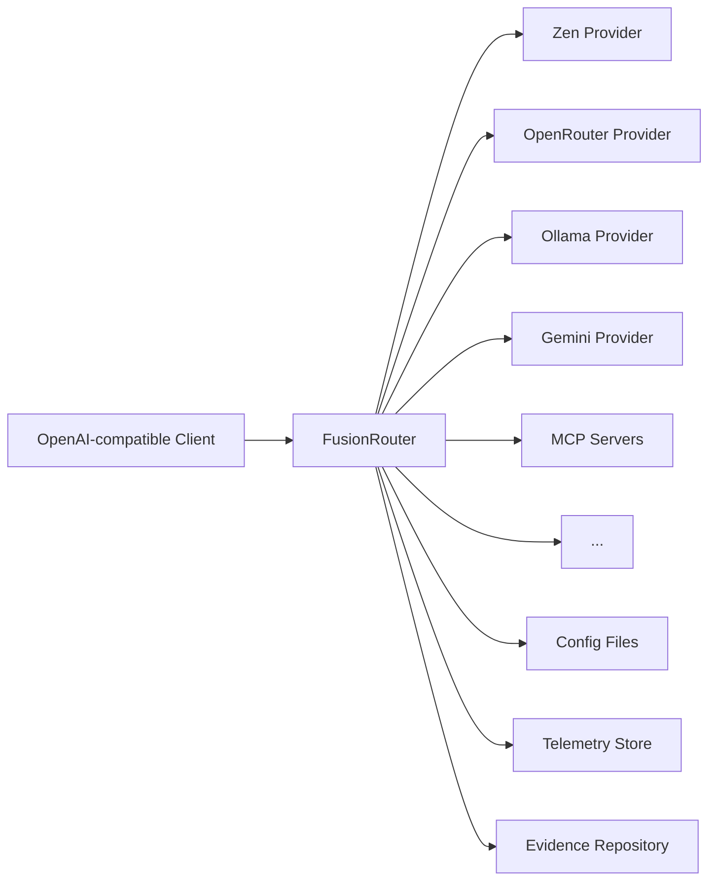
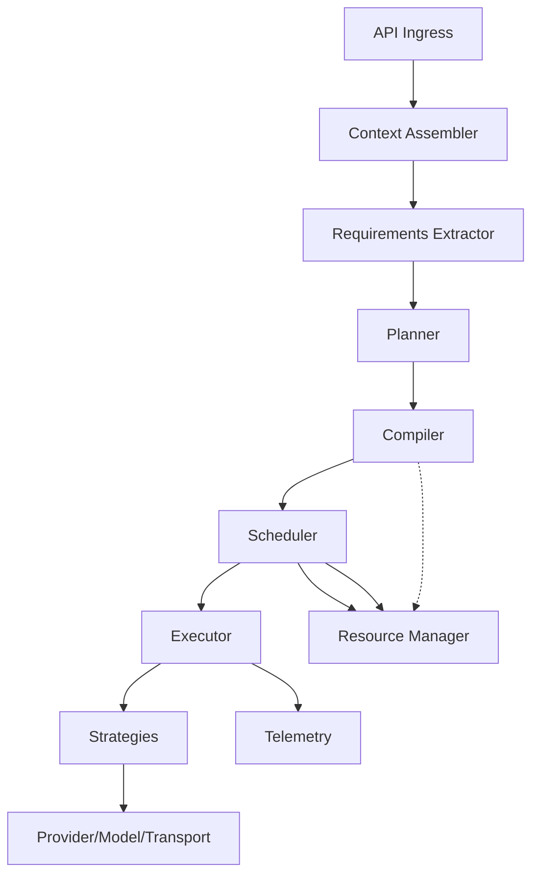
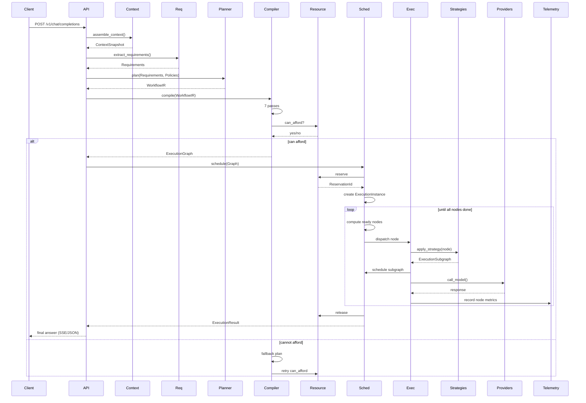

# FusionRouter Architecture Specification – Final Revisions

**Version:** 1.0 (Approved)  
**Status:** Architecture Frozen – Implementation in Progress  
**Date:** 2026-07-17  
**Repository:** [github.com/NeutronZero/fusion-router](https://github.com/NeutronZero/fusion-router)

---

## Summary of Changes

This version addresses all feedback from the final review:

1. **Implementation Scope Removed** – Released as a separate `docs/implementation/status.md` tracking document.
2. **Terminology Clarified** – Added note that `ExecutionGraph` is the canonical term; historical references to `ExecutionPlan` are unified.
3. **Resource Manager Interaction Clarified** – Compiler only *queries* resource availability; reservation occurs during scheduling.
4. **Glossary Added** – One‑page reference for all key terms.
5. **ADR Governance Rule Added** – Any invariant change requires a superseding ADR and major‑version review.

---

## Document Structure

This specification is organised into the following sections:

1. Introduction & Core Philosophy
2. Architectural Invariants (Frozen)
3. System Context
4. Component Architecture
5. Data Models (Core Types)
6. Compiler Pass Pipeline
7. Execution Flow
8. Extensibility & Plugin System
9. Resource Management
10. Observability & Telemetry
11. Testing Philosophy
12. Key Design Decisions
13. Future Directions
14. Glossary
15. Project Documents (Canonical)
16. Governance Rules

---

## 1. Introduction & Core Philosophy

FusionRouter is a **self‑hosted LLM orchestration engine** that transforms a user prompt into an optimised, executable DAG (Directed Acyclic Graph) of model calls, tools, and control flow. It sits between any OpenAI‑compatible client (like OpenCode) and multiple AI providers, offering a unified API, deterministic compilation, pluggable strategies, resource‑aware execution, and an extensible plugin system.

### 1.1 Conceptual Pipeline

```text
Prompt
   │
   ▼
Context Assembler → ContextSnapshot
   │
   ▼
Requirements Extractor → Requirements
   │
   ▼
Planner → WorkflowIR
   │
   ▼
Compiler (7 pure passes) → ExecutionGraph
   │
   ▼
Scheduler → ExecutionInstance
   │
   ▼
Executor (Strategies → Subgraphs) → ExecutionResult
   │
   ▼
Providers → Final Answer
```

### 1.2 Evolution from Original Goal

FusionRouter began as an exploration of multi‑model deliberation but has evolved into a **general‑purpose orchestration engine** for agentic systems. The core abstraction is no longer "route to the right model" but:

> **Compile a high‑level workflow into an executable DAG, execute it deterministically, and return the result.**

---

## 2. Architectural Invariants (Frozen)

These principles are **immutable** and define the system's long‑term stability. **Any change to an invariant requires a superseding ADR and a major‑version architectural review.**

| # | Invariant |
|---|-----------|
| 1 | **Orchestration, not routing** – plan *what* to do, not just *which* model. |
| 2 | **Compiler pipeline** – transform an Intermediate Representation (IR) into an immutable `ExecutionGraph` through pure passes. |
| 3 | **Graph‑based execution** – workflows are DAGs with nodes for LLMs, tools, conditionals, loops, splits, joins, and barriers. |
| 4 | **Plan‑state‑context separation** – plan (graph) is immutable, state (execution) is mutable, context (input) is immutable. |
| 5 | **Declarative policies** – compose cost, latency, safety, and privacy policies separately. |
| 6 | **Capability + constraint** – model selection applies hard constraints first, then weighted scores. |
| 7 | **Budget & resources are first‑class** – per‑request budgets and global resource pools are explicit. |
| 8 | **Provider & transport agnostic** – providers own auth/billing, models own capabilities, transports are abstract (HTTP, SSE, WebSocket, stdio, gRPC). |
| 9 | **Tools & retrievers are native nodes** – non‑LLM actions are first‑class graph nodes. |
| 10 | **Evidence is versioned** – learning produces snapshots for deterministic replay. |
| 11 | **Observability by design** – every artifact has a stable ID; `tracing` spans cover all phases. |
| 12 | **Deterministic execution** – identical inputs produce identical execution decisions. |
| 13 | **Runtime failures do not alter the compiled graph** – re‑compilation, if needed, must be explicit. |
| 14 | **Compiler passes are pure** – no I/O, no side effects, no global mutations. |

**Terminology Note:** Earlier design discussions may refer to the immutable execution specification as `ExecutionPlan` or `ExecutionGraph`. In the final architecture, these terms are unified under `ExecutionGraph`. Historical ADRs retain their original terminology; future documents should use `ExecutionGraph`.

---

## 3. System Context



---

## 4. Component Architecture

### 4.1 Component Responsibilities

| Component | Responsibility | Input | Output |
|-----------|---------------|-------|--------|
| **API Ingress** | HTTP server, request parsing, streaming | HTTP request | Parsed request |
| **Context Assembler** | Session history, trimming, attachments | Parsed request | `ContextSnapshot` |
| **Requirements Extractor** | Intent, complexity, soft/hard constraints | `ContextSnapshot` | `Requirements` |
| **Planner** | Policy evaluation, workflow matching | `Requirements` | `WorkflowIR` |
| **Compiler** | Validation, resolution, optimisation | `WorkflowIR` | `ExecutionGraph` |
| **Resource Manager** | Quotas, budgets, reservations | `ExecutionGraph` | Affordability decision |
| **Scheduler** | Dependency tracking, state management | `ExecutionGraph` | `ExecutionInstance` |
| **Executor** | Node execution, strategy invocation | Ready nodes | `ExecutionResult` |
| **Strategy** | Sub‑graph generation | `ExecutionNode` | `ExecutionSubgraph` |
| **Provider** | Auth, billing, model enumeration | `ProviderRequest` | `ProviderResponse` |
| **Model** | Capabilities, pricing, quotas | Configuration | `ModelCapability` |
| **Transport** | Protocol abstraction | `TransportRequest` | `TransportResponse` |
| **Telemetry** | Tracing, structured logging, evidence | Execution events | Logs, snapshots |

### 4.2 Component Interaction Diagram



**Note:** The compiler **queries** the Resource Manager (`can_afford?`) but does not reserve resources. Reservation occurs during scheduling, preserving compiler purity.

---

## 5. Data Models (Core Types)

### 5.1 ContextSnapshot (Immutable Input)

```rust
pub struct ContextSnapshot {
    pub id: SnapshotId,
    pub messages: Vec<Message>,
    pub files: Vec<File>,
    pub tool_results: Vec<ToolResult>,
    pub retrieved_snippets: Vec<String>,
    pub token_count: u32,
}
```

### 5.2 Requirements (Semantic Classification)

```rust
pub struct Requirements {
    // Soft scores (0.0..1.0)
    pub coding: f32,
    pub reasoning: f32,
    pub cost_sensitivity: f32,
    pub intent_confidence: f32,
    // Hard constraints
    pub min_context_tokens: u32,
    pub requires_tools: bool,
    pub requires_vision: bool,
    pub requires_json_mode: bool,
}
```

### 5.3 WorkflowIR (Intermediate Representation)

```rust
pub struct WorkflowIR {
    pub id: WorkflowId,
    pub goal: String,
    pub nodes: Vec<IRNode>,
    pub edges: Vec<IREdge>,
}

pub enum IRNodeKind {
    Generate,
    Review,
    Judge,
    Transform,
    Gate,
    Conditional,
    Loop,
    Split,
    Join,
    Barrier,
    Tool(String),
    Retriever(String),
    HumanApproval,
    Cache,
}
```

### 5.4 ExecutionGraph (Immutable, Compiled)

```rust
pub struct ExecutionGraph {
    pub id: GraphId,
    pub nodes: Vec<ExecutionNode>,
    pub edges: Vec<ExecutionEdge>,
}

pub struct ExecutionNode {
    pub id: NodeId,
    pub kind: NodeKind,
    pub requirements: Requirements,
    pub resolved_model: Option<ModelId>,
    pub strategy: StrategyType,
    pub config: serde_json::Value,
    pub retry_policy: Option<RetryPolicy>,
}

pub struct ExecutionEdge {
    pub from: NodeId,
    pub to: NodeId,
    pub condition: Option<String>,  // conditional branching
}
```

### 5.5 ExecutionInstance (Runtime State)

```rust
pub struct ExecutionInstance {
    pub instance_id: InstanceId,
    pub graph_id: GraphId,
    pub state: InstanceState,       // Pending, Running, Paused, Cancelled, Completed, Failed
    pub node_states: HashMap<NodeId, NodeState>,
    pub node_outputs: HashMap<NodeId, NodeOutput>,
    pub start_time: DateTime,
    pub last_update: DateTime,
}
```

### 5.6 ExecutionResult (Final Output)

```rust
pub struct ExecutionResult {
    pub graph_id: GraphId,
    pub final_answer: String,
    pub outputs: HashMap<NodeId, Value>,
    pub metrics: ExecutionMetrics,   // tokens, cost, latency per node
    pub provenance: Vec<ProvenanceEntry>,
    pub diagnostics: Vec<Diagnostic>,
    pub artifacts: HashMap<String, Value>,
}
```

---

## 6. Compiler Pass Pipeline

The compiler transforms `WorkflowIR` into `ExecutionGraph` through **seven pure passes**:

```text
WorkflowIR
   │
   ▼
1. Constraint Validation
   ├─ Verify hard constraints
   ├─ Check capability requirements
   └─ Validate control flow structure
   │
   ▼
2. Capability Resolution
   ├─ Query model registry
   ├─ Apply hard constraints → eligible models
   └─ Select best model (weighted scoring)
   │
   ▼
3. Budget Optimisation
   ├─ Estimate cost/tokens
   ├─ Query Resource Manager (can_afford?)
   └─ Downgrade models if needed
   │
   ▼
4. Node Fusion
   ├─ Merge adjacent nodes
   └─ Reduce overhead
   │
   ▼
5. Retry & Fallback Insertion
   ├─ Add fallback nodes
   └─ Attach retry policies
   │
   ▼
6. Scheduling Hints
   ├─ Attach parallelism hints
   ├─ Assign priority
   └─ Resource requirements
   │
   ▼
7. Graph Verification
   ├─ Check acyclicity
   ├─ Verify reachability
   ├─ Validate resource bounds
   └─ Confirm determinism
   │
   ▼
ExecutionGraph
```

**All passes are pure** – no I/O, no network calls, no side effects. This guarantees deterministic compilation and enables golden‑test replay.

---

## 7. Execution Flow (Detailed)

### 7.1 Request Lifecycle



### 7.2 Strategies (Sub‑graph Generators)

Each strategy implements the `Strategy` trait and returns an `ExecutionSubgraph`:

| Strategy | Behaviour | Subgraph Structure |
|----------|-----------|---------------------|
| **Single** | One model call | `[LLM]` |
| **Consensus** | N parallel models + judge | `[LLM A, LLM B, …]` → `[Judge]` |
| **Reflection** | Generate → Review → Regenerate | `[Generate]` → `[Review]` → `[Gate]` |
| **Chain** | Pipeline of sub‑strategies | `[Stage1]` → `[Stage2]` → `[…]` |
| **ReAct** | Loop: Reason → Act → Observe | `Loop([Reason] → [Tool] → [Observe])` |
| **Debate** | Multiple debaters → judge | `[Debater A, Debater B, …]` → `[Judge]` |

All strategies reuse the same execution engine and can be nested or combined.

---

## 8. Extensibility & Plugin System

### 8.1 Extension Points

| Extension Point | Responsibility |
|-----------------|----------------|
| **Provider** | Add new LLM APIs (auth, billing, model enumeration) |
| **Strategy** | New orchestration patterns (sub‑graph generators) |
| **Compiler Pass** | Custom validation, optimisation, instrumentation |
| **Transport** | New protocols (WebSocket, stdio, gRPC) |
| **Policy** | Custom cost, latency, safety rules |

### 8.2 Plugin Architecture

- **Manifest:** TOML file in `plugins/` directory.
- **Lifecycle:** Discovery → Load → Validate → Initialize → Register → Activate.
- **Implementation:** Currently `libloading` (C ABI); future support for WASM, subprocesses, RPC.
- **Sample Plugin:** Bundled `example-provider` demonstrates the ABI.

Plugins keep the core lean and allow the ecosystem to grow organically.

---

## 9. Resource Management

### 9.1 Per‑Request Budget

```rust
pub struct ExecutionBudget {
    pub max_latency_ms: Option<u64>,
    pub max_tokens: Option<u64>,
    pub max_dollar_cost: Option<f64>,
    pub max_retries_per_stage: u32,
}
```

### 9.2 Global Resources

- Concurrency limits
- Daily quotas (cost/token)
- Rate limits (per provider)
- GPU memory
- MCP connections
- Licenses

### 9.3 Reservation Abstraction

The Resource Manager owns **reservations** – resources are held only for the duration of execution.

```rust
pub trait ResourceManager {
    fn can_afford(&self, graph: &ExecutionGraph) -> bool;  // queried by compiler
    fn reserve(&self, graph: &ExecutionGraph) -> ReservationId; // called by scheduler
    fn release(&self, reservation: ReservationId);
    fn report_usage(&self, provider: ProviderId, tokens: u64, cost: f64);
    fn query(&self, resource: ResourceType) -> ResourceStatus;
}
```

**Design Note:** The compiler **queries** (`can_afford`) but does not reserve. Reservation occurs during scheduling, preserving compiler purity.

---

## 10. Observability & Telemetry

### 10.1 Tracing

`tracing` spans cover every phase:

- **Ingress** – request ID, timestamp
- **Planner** – workflow selection, IR generation
- **Compiler** – each pass execution
- **Scheduler** – node dispatch, state transitions
- **Executor** – node execution, strategy invocation
- **Provider** – model call, latency, tokens

### 10.2 Evidence Repository

- SQLite‑backed structured logs.
- Periodic snapshots of success rates, latencies, costs per `(intent, complexity, model, node_type)`.
- Snapshots are **versioned** and queryable by the Planner for routing recommendations.

### 10.3 Stable IDs

Every artifact has a stable ID:

- `PlanId`, `GraphId`, `InstanceId`, `NodeId`, `TraceId`, `CallId`

This enables deterministic replay and facilitates debugging.

---

## 11. Testing Philosophy

| Test Level | Purpose |
|------------|---------|
| **Unit tests** | Isolated component behaviour |
| **Golden tests** | Compiler determinism; fixed inputs → expected outputs |
| **Replay tests** | Reproduce execution decisions with identical snapshots |
| **Integration tests** | End‑to‑end with mock and real providers |
| **Load tests** | Concurrency, quotas, and performance validation |

Golden tests are a first‑class citizen due to invariant #12 (determinism).

---

## 12. Key Design Decisions

| Decision | Rationale |
|----------|-----------|
| **IR → Compiler → Graph** | Enables validation, optimisation, and verification before execution; deterministic replay; golden tests. |
| **Pure compiler passes** | Guarantees determinism; allows caching and formal verification. |
| **Strategies as graph generators** | Reuse the same execution engine for all workflows; strategies are composable. |
| **Budget as first‑class** | Prevents cost overruns; enables safe multi‑model orchestration. |
| **Plugin system** | Keeps the core lean; encourages community contributions; decouples providers from core. |
| **Versioned evidence** | Ensures deterministic replay; learning is explicit and audit‑able. |
| **Rust implementation** | Memory safety, performance, and fearless concurrency; strong type system. |

---

## 13. Future Directions

### Near‑term (v1.0+)
- **Dynamic Workflow Generation** – allow an LLM to plan its own execution graph from user intent.
- **Tool Registry** – native tool management for ReAct and other strategies.
- **Semantic Caching** – reduce cost and latency for repeated prompts.
- **Prometheus Metrics** – production monitoring.
- **Audit Logs** – compliance and traceability.

### Long‑term (v2.0+)
- **Full Multi‑Agent Collaboration** – deep integration with agent frameworks.
- **Advanced Compiler Optimisations** – automatic batching, speculative execution.
- **Distributed Execution** – scale across multiple nodes.
- **More Transports** – WebSocket, stdio, gRPC.

**Implementation Status:** The current implementation status is tracked separately in `docs/implementation/status.md` and the `CHANGELOG.md`. This architecture document describes *what the system supports*, not *what a particular release has implemented*.

---

## 14. Glossary

| Term | Definition |
|------|------------|
| **ContextSnapshot** | Immutable input state (messages, files, tool results). |
| **Requirements** | Semantic classification of the request (intent, complexity, constraints). |
| **WorkflowIR** | Intermediate Representation – a high‑level, abstract workflow (language‑independent). |
| **ExecutionGraph** | Immutable, compiled DAG of executable nodes and edges. |
| **ExecutionInstance** | Runtime state of a graph execution (mutable). |
| **ExecutionSubgraph** | A small DAG generated by a Strategy (e.g., Consensus expands to parallel generators + judge). |
| **ExecutionResult** | The final output of execution (answer, metrics, provenance). |
| **Strategy** | A pluggable graph generator (Single, Consensus, Reflection, Chain, ReAct, Debate). |
| **Provider** | External LLM service (e.g., Zen, OpenRouter). Owns auth/billing. |
| **Model** | A specific model within a provider (e.g., `zen-7b`). Owns capabilities/pricing. |
| **Transport** | Communication protocol (HTTP, SSE, WebSocket, stdio, gRPC). |
| **Resource Manager** | Enforces budgets and global quotas; owns reservations. |
| **EvidenceSnapshot** | Versioned aggregation of performance metrics (success rates, latencies, costs). |
| **Pass** | A pure transformation step in the compiler pipeline. |
| **ADR** | Architecture Decision Record – documents design decisions and rationale. |

---

## 15. Project Documents (Canonical)

| Document | Purpose | Location |
|----------|---------|----------|
| **Architecture Overview** | Introduction and high‑level concepts | `docs/architecture/overview.md` |
| **Architecture Specification** | Complete architectural definition (this document) | `docs/architecture/specification.md` |
| **Architecture Decision Records** | Design decisions and rationale | `docs/adr/` |
| **Subsystem Specifications** | Public contracts (IR, Graph, Provider API, etc.) | `docs/specifications/` |
| **Implementation Roadmap** | Development milestones | `docs/implementation/roadmap.md` |
| **Implementation Status** | What has been implemented | `docs/implementation/status.md` |
| **Plugin Developer Guide** | How to write plugins | `docs/plugin-guide.md` |

---

## 16. Governance Rules

### Document Governance
- **Architecture Overview:** Changes only for major conceptual shifts.
- **Architecture Specification:** Changes through ADRs when invariants evolve.
- **Implementation:** Evolves continuously.
- **Public APIs:** Evolve according to the compatibility contract (stable within major version).

### ADR Rule
> **Any proposal that changes one of the fourteen architectural invariants requires a superseding ADR and a major‑version architectural review.**

### Architecture Review
- The Architecture Overview and Specification are reviewed and approved by the project's architectural owner before any changes are merged.
- Minor clarifications and corrections do not require a full ADR if they don't alter the invariants.

---

## Final Assessment

This architecture specification defines a stable, internally consistent foundation for FusionRouter. The system is no longer fundamentally about routing models – it is about:

> Compiling high‑level workflows into executable DAGs and executing them deterministically.

With the glossary added, governance explicit, and terminology unified, this document is ready to serve as the authoritative reference for the project.

**The architecture is frozen.** Future implementation progress will be tracked through ADRs, changelogs, and implementation status documents. The most valuable discoveries from this point onward are likely to come from implementation experience—performance characteristics, API ergonomics, and operational behavior—rather than further changes to the architectural model.

---

*This document is the authoritative source for FusionRouter's architecture. It is maintained in the repository at `docs/architecture/specification.md`.*
