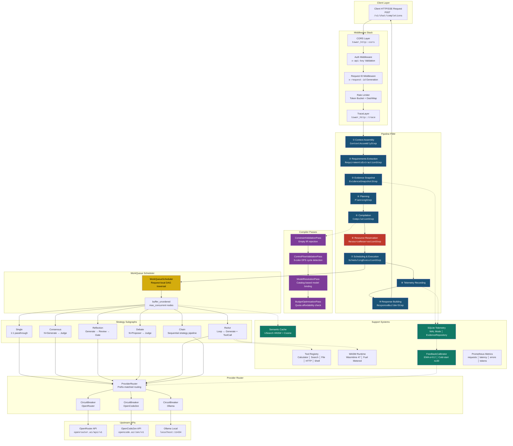
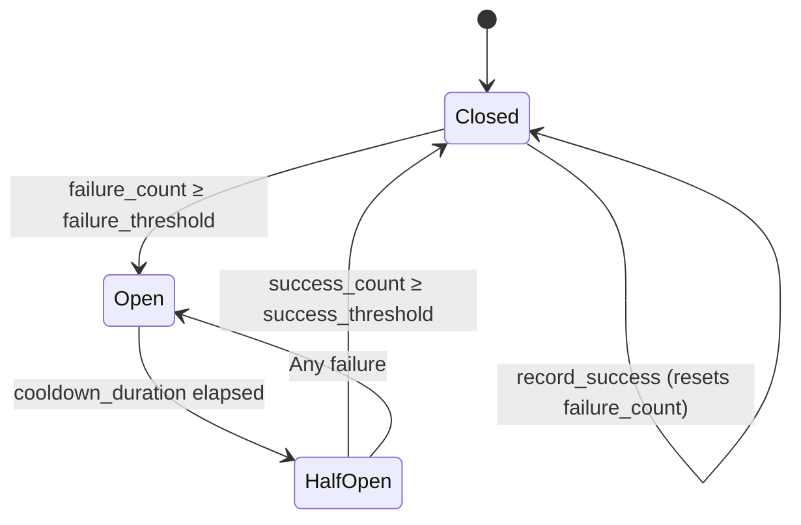

# FusionRouter v0.8.0 — System Architecture Specification & Engineering Reference

> **Classification**: Production-Grade Technical Architecture Document
> **Version**: 0.8.0 | **Edition**: Rust 2021 | **Date**: 2026-07-25
> **Repository**: `fusion-router`

---

## Table of Contents

1. [Executive Overview & Architectural Philosophy](#1-executive-overview--architectural-philosophy)
2. [Full System Architecture Diagram](#2-full-system-architecture-diagram)
3. [Subsystem Engineering Reference](#3-subsystem-engineering-reference)
   - 3.1 [Staged Request Pipeline](#31-staged-request-pipeline)
   - 3.2 [Context Assembly & Safety Mechanics](#32-context-assembly--safety-mechanics)
   - 3.3 [Requirements Extraction & Intent Classification](#33-requirements-extraction--intent-classification)
   - 3.4 [Compiler & DAG Execution Engine](#34-compiler--dag-execution-engine)
   - 3.4.5 [Planning Subsystem](#345-planning-subsystem)
   - 3.5 [Resource Safety & Budget Envelopes](#35-resource-safety--budget-envelopes)
   - 3.6 [Provider Selection & Resilience](#36-provider-selection--resilience)
   - 3.7 [Reasoning Strategies](#37-reasoning-strategies)
   - 3.8 [Closed-Loop Feedback Calibration](#38-closed-loop-feedback-calibration)
   - 3.9 [Semantic Vector Cache](#39-semantic-vector-cache)
   - 3.10 [Sandboxed Extension Engine](#310-sandboxed-extension-engine)
   - 3.11 [Tools & Registry](#311-tools--registry)
   - 3.12 [Telemetry & Observability](#312-telemetry--observability)
4. [Request Lifecycle Walkthrough](#4-request-lifecycle-walkthrough)
5. [Security, Concurrency & Resilience Matrix](#5-security-concurrency--resilience-matrix)
6. [Workspace Structure & Dependency Mapping](#6-workspace-structure--dependency-mapping)
7. [Exhaustive Architectural Gap Analysis & Resolution Matrix](#7-exhaustive-architectural-gap-analysis--resolution-matrix)

---

## 1. Executive Overview & Architectural Philosophy

### Purpose

FusionRouter is an **intelligent LLM orchestration router** that decouples *reasoning strategies* from *physical LLM providers*. It accepts OpenAI-compatible `/v1/chat/completions` requests and dynamically selects the optimal execution strategy (single-shot, consensus, reflection, debate, ReAct tool loops, or chained pipelines) and provider backend (OpenRouter, OpenCodeZen, Ollama) based on real-time intent analysis, budget constraints, and historical performance telemetry.

### Core Architectural Principles

| Principle | Mechanism |
|-----------|-----------|
| **Strategy–Provider Decoupling** | `Strategy` trait emits `ExecutionSubgraph` DAGs independent of provider identity; `ProviderRouter` resolves physical endpoints at execution time |
| **Compile-Before-Execute** | All `WorkflowIR` passes through a transactional `Compiler` pipeline (constraint → control-flow → model resolution → budget) before any LLM call is made |
| **RAII Resource Safety** | `ResourceGuard` auto-releases quota on `Drop` if uncommitted; `BudgetEnvelope` enforces per-request cost/token/iteration ceilings via `Arc<AtomicU64>` |
| **Closed-Loop Calibration** | `FeedbackCalibrator` EMA-smooths observed success rates into provider capability scores, driving future routing decisions |
| **Defense-in-Depth Isolation** | Circuit breakers per-provider, fuel-metered WASM sandboxes, command allow-lists for shell tools, path-traversal guards for file reads |

### Technology Stack

| Layer | Technology | Version |
|-------|------------|---------|
| Language | Rust | 2021 Edition |
| Async Runtime | Tokio | 1.x (full features) |
| HTTP Framework | Axum | 0.7 |
| WASM Sandbox | Wasmtime | 47 (feature-gated: `wasm-plugins`) |
| Vector Index | USearch | 2.x (feature-gated: `semantic-cache`) |
| Telemetry DB | Rusqlite (SQLite) | 0.29 (bundled, WAL mode) |
| Metrics | Prometheus | 0.13 |
| Tracing | tracing + tracing-subscriber | 0.1 / 0.3 |
| OpenTelemetry | opentelemetry-otlp | 0.27 (feature-gated: `otel`) |

---

## 2. Full System Architecture Diagram



---

## 3. Subsystem Engineering Reference

### 3.1 Staged Request Pipeline

The request pipeline is a **typed state machine** where each stage is a concrete implementation of the `PipelineStep<Input, Output>` trait, carrying state through a mutable `PipelineContext`.

#### Core Trait Definition

```rust
// src/server/pipeline.rs
#[async_trait]
pub trait PipelineStep<Input, Output>: Send + Sync {
    async fn execute(
        &self,
        input: Input,
        ctx: &mut PipelineContext,
    ) -> Result<Output, RouterError>;
}
```

#### Pipeline Context

```rust
pub struct PipelineContext {
    pub request_id: Uuid,
    pub cancellation_token: CancellationToken,   // tokio_util cooperative shutdown
    pub request: ChatCompletionRequest,
    pub assembled_context: Option<ContextSnapshot>,
    pub requirements: Option<Requirements>,
    pub evidence: Option<EvidenceSnapshot>,
    pub ir: Option<WorkflowIR>,
    pub graph: Option<ExecutionGraph>,
    pub resource_guard: Option<ResourceGuard>,
    pub execution_result: Option<ExecutionResult>,
    pub response: Option<ChatCompletionResponse>,
    pub budget_envelope: Option<BudgetEnvelope>,
}
```

#### Stage Attribution via `RouterError<PipelineStage>`

Every pipeline failure carries a `PipelineStage` discriminant and the originating `request_id`:

```rust
// src/types/error.rs
#[derive(Debug, Clone, Copy, PartialEq, Eq)]
pub enum PipelineStage {
    ContextAssembly, RequirementsExtraction, EvidenceSnapshot,
    Planning, Compilation, ResourceReservation, Scheduling,
    Execution, TelemetryRecording, ResponseBuilding,
}

pub enum RouterError {
    StageFailure    { stage: PipelineStage, request_id: Uuid, message: String },
    ResourceExhausted { request_id: Uuid, details: String },
    CapacityExceeded  { request_id: Uuid, details: String },
    ClientCancelled   { request_id: Uuid },
    BudgetExceeded    { stage: PipelineStage, request_id: Uuid, detail: String },
    MaxIterationsExceeded { stage: PipelineStage, request_id: Uuid, current: u64, max: u32 },
    Internal          { request_id: Uuid, message: String },
}
```

Each variant maps to an HTTP status code: `StageFailure` → 500, `ResourceExhausted` / `BudgetExceeded` / `MaxIterationsExceeded` → 429, `CapacityExceeded` → 503, `ClientCancelled` → 400.

#### Cancellation Token Teardown

The `CancellationToken` (from `tokio_util`) is threaded through every pipeline stage and into the scheduler. In `run_with_cancellation`, each node execution is wrapped in a `tokio::select!` with biased cancellation:

```rust
tokio::select! {
    biased;
    _ = token.cancelled() => {
        (node.id, NodeExecutionResult {
            state: NodeState::Failed("Cancelled by client".into()),
            ..
        })
    }
    result = executor.execute_node(&node) => { (node.id, result) }
}
```

This guarantees that pending LLM calls are abandoned immediately upon client disconnect, with no resource leak due to the `ResourceGuard` RAII pattern (§3.5).

#### Concrete Pipeline Steps

| Step | Trait Signature | Architectural Role |
|------|----------------|-------------------|
| `ContextAssemblyStep` | `PipelineStep<ChatCompletionRequest, ContextSnapshot>` | Token-budget trimming, UTF-8 boundary preservation |
| `RequirementsExtractionStep` | `PipelineStep<ContextSnapshot, Requirements>` | Intent classification, model requirements derivation |
| `EvidenceSnapshotStep` | `PipelineStep<(), Option<EvidenceSnapshot>>` | SQLite aggregation of historical telemetry |
| `PlanningStep` | `PipelineStep<(Requirements, Option<EvidenceSnapshot>), WorkflowIR>` | Intent-to-IR strategy selection, policy application |
| `CompilationStep` | `PipelineStep<WorkflowIR, ExecutionGraph>` | Transactional pass pipeline, DAG lowering |
| `ResourceReservationStep` | `PipelineStep<ExecutionGraph, ResourceGuard>` | Atomic quota reservation with RAII guard |
| `SchedulingExecutionStep` | `PipelineStep<(ExecutionGraph, ReservationId), ExecutionResult>` | DAG traversal, concurrent node execution, budget enforcement |
| `ResponseBuilderStep` | `PipelineStep<ExecutionResult, ChatCompletionResponse>` | OpenAI-compatible response assembly |

---

### 3.2 Context Assembly & Safety Mechanics

#### Token Depth Estimation

```rust
// src/context/assembler.rs
pub fn estimate_tokens(text: &str) -> u32 {
    (text.len() as u32).div_ceil(4)   // ~4 bytes per token heuristic
}
```

#### Backwards History Trimming with UTF-8 Boundary Preservation

The `DefaultContextAssembler` implements a **reverse-chronological trimming** algorithm that:

1. **Preserves all system messages** unconditionally (deducted from budget first)
2. **Iterates user/assistant messages in reverse order** (newest first), adding each if it fits within the remaining token budget
3. **Partial-message slicing** for edge cases where a message partially fits:

```rust
// Multi-byte UTF-8 boundary-safe slicing
let byte_limit = (remaining * 4) as usize;
let safe_end = msg.content.char_indices()
    .map(|(i, c)| i + c.len_utf8())
    .take_while(|&i| i <= byte_limit)
    .last()
    .unwrap_or(0);
let truncated: String = msg.content[..safe_end].to_string();
```

This `char_indices()` scan ensures the slice point always falls on a valid UTF-8 character boundary, preventing panics on multi-byte characters (CJK, emoji, etc.).

#### Assembly Output

```rust
pub struct ContextSnapshot {
    pub messages: Vec<ChatMessage>,
    pub files: Vec<FileRef>,
    pub tools: Vec<ToolDefinition>,
    pub max_tokens: u32,
    pub temperature: f32,
}
```

---

### 3.3 Requirements Extraction & Intent Classification

#### Keyword-Based Intent Classification

```rust
// src/requirements/extractor.rs
fn classify_intent(ctx: &ContextSnapshot) -> Intent {
    let keywords = [
        (Intent::Code,         vec!["code", "function", "implement", "write a program", "class", "api"]),
        (Intent::Debug,        vec!["bug", "error", "fix", "issue", "crash", "incorrect"]),
        (Intent::Architecture, vec!["design", "architecture", "system", "component", "module"]),
        (Intent::Analysis,     vec!["analyze", "explain", "compare", "evaluate", "review"]),
        (Intent::Creative,     vec!["story", "poem", "creative", "imagine", "generate"]),
    ];
    // Score each intent by keyword match count, default to Intent::General
}
```

#### Complexity Thresholds

```rust
fn compute_complexity(ctx: &ContextSnapshot) -> ComplexityLevel {
    match (total_chars, file_count) {
        (c, _) if c > 10_000          => ComplexityLevel::Critical,
        (c, f) if c > 5_000 || f > 5  => ComplexityLevel::High,
        (c, f) if c > 1_000 || f > 2  => ComplexityLevel::Medium,
        _                              => ComplexityLevel::Low,
    }
}
```

#### Model Requirements Derivation

The extractor automatically derives `ModelRequirements` based on intent:

| Intent | `min_coding_score` | `min_reasoning_score` | `requires_tools` |
|--------|-------------------|-----------------------|-------------------|
| `Code` / `Debug` | `0.8` | — | Conditional |
| `Architecture` | `0.7` | `0.85` | — |
| `Analysis` | — | `0.7` | — |
| `General` / `Creative` | — | — | — |

Long-context requests (any message > 10,000 chars) automatically set `min_context_tokens = 32_000`. All requests default to `requires_streaming = true`.

---

### 3.4 Compiler & DAG Execution Engine

#### WorkflowIR Structure

```rust
pub struct WorkflowIR {
    pub plan_id: Uuid,
    pub nodes: Vec<IRNode>,
    pub edges: Vec<IREdge>,
    pub metadata: IRMetadata,
}

pub enum IRNodeKind {
    Generate, Review, Judge, Transform, Gate,
    Conditional, Loop, Split, Join, Barrier,
}

// Lowered execution-level node kinds (11 variants)
pub enum ExecutionNodeKind {
    LLMGenerate, LLMReview, LLMJudge, Transform, Gate,
    Aggregate,      // Collection/accumulation node (no implementation struct yet)
    Conditional, Loop, Split, Join, Barrier,
}
```

#### Transactional Compiler

The `DefaultCompiler` implements a **snapshot-and-rollback** transactional compilation strategy:

```rust
// src/compiler/mod.rs
async fn compile(&self, ir: WorkflowIR) -> Result<ExecutionGraph, CompilerError> {
    let snapshot = ir.clone();    // Pre-pass snapshot
    let mut current = ir;
    for pass in &self.passes {
        match pass.apply(current.clone()).await {
            Ok(next) => { current = next; }
            Err(e) => {
                // Transaction rolled back to initial IR snapshot
                return Err(e);
            }
        }
    }
    lower_to_graph(current)       // Final IR → ExecutionGraph lowering
}
```

#### Compiler Pass Pipeline

| Pass | Struct | Responsibility |
|------|--------|---------------|
| 1 | `ConstraintValidationPass` | Rejects empty IR graphs |
| 2 | `ControlFlowValidationPass` | Validates structural invariants for `Conditional`, `Loop`, `Split`, `Join`, `Barrier` nodes; runs **3-color DFS cycle detection** |
| 3 | `ModelResolutionPass` | Binds unresolved `node.model = None` to catalog entries based on `ModelRequirements` |
| 4 | `BudgetOptimisationPass` | Pre-flight check against `ResourceManager::can_afford()` |

#### 3-Color DFS Cycle Detection

```rust
// src/compiler/passes.rs
fn three_color_cycle_detect(edges: &[(Uuid, Uuid)]) -> Result<(), Uuid> {
    enum Color { White, Grey, Black }
    // Standard textbook algorithm:
    // - White: unvisited
    // - Grey: currently in DFS stack (back-edge to Grey = cycle)
    // - Black: fully processed
    fn dfs(node, graph, colors) -> bool {
        colors.insert(node, Grey);
        for &next in graph[node] {
            match colors[next] {
                Grey  => return true,   // Cycle detected!
                White => if dfs(next, graph, colors) { return true; }
                Black => continue,
            }
        }
        colors.insert(node, Black);
        false
    }
}
```

> [!IMPORTANT]
> Loop back-edges (`condition == "loop"`) are **excluded** from cycle detection, as they represent intentional iterative control flow.

#### Control Flow Validation Rules

| Node Kind | Validation Rule |
|-----------|----------------|
| `Conditional` | ≥1 outgoing edge, ≥1 edge with a condition |
| `Loop` | ≥1 outgoing edge, `max_iterations` in config |
| `Split` | ≥2 outgoing edges |
| `Join` | ≥2 incoming edges |
| `Barrier` | ≥1 incoming edge AND ≥1 outgoing edge |

#### Model Resolution Catalog

```rust
impl Default for ModelCatalog {
    fn default() -> Self {
        Self {
            code:         "claude-sonnet-4-20250514".into(),
            debug:        "claude-sonnet-4-20250514".into(),
            architecture: "claude-opus-4-20250514".into(),
            general:      "gpt-4o".into(),
            creative:     "claude-sonnet-4-20250514".into(),
            analysis:     "claude-opus-4-20250514".into(),
            fast:         "gpt-4o-mini".into(),
            cheap:        "gpt-4o-mini".into(),
        }
    }
}
```

Resolution priority: `requires_tools` → `code` | `min_coding_score ≥ 0.8` → `code` | `min_reasoning_score ≥ 0.8` → `architecture` | default → `fast`.

#### 3.4.5 Planning Subsystem

The planning subsystem converts `Requirements` into `WorkflowIR` via a trait-based abstraction supporting 4 planner implementations.

##### Planner Trait

```rust
// src/planner/mod.rs
#[async_trait]
pub trait Planner: Send + Sync {
    async fn plan(
        &self,
        requirements: &Requirements,
        policies: &[Policy],
        evidence: Option<&EvidenceSnapshot>,
    ) -> WorkflowIR;
}

pub enum PlannerMode {
    Static,    // Use WorkflowRegistry definitions only
    Dynamic,   // Use DynamicPlanner (LLM-generated IRs)
    Hybrid,    // Try Dynamic, fall back to Static
}
```

##### IntentPlanner (Primary Planner)

The `IntentPlanner` is the **default production planner** (`pub use intent_planner::IntentPlanner`). It maps `ExecutionIntent` modes — **not** keyword-based `Intent` — to fixed-template IR graphs with pre-determined node counts and strategies.

**Two-phase selection**:

1. **Model selection** via keyword `Intent` (from requirements extractor):

```rust
fn select_model(&self, requirements: &Requirements) -> String {
    match requirements.intent_classification {
        Intent::Code | Intent::Debug => self.model_catalog.code.clone(),
        Intent::Architecture         => self.model_catalog.architecture.clone(),
        Intent::Analysis             => self.model_catalog.analysis.clone(),
        Intent::Creative             => self.model_catalog.creative.clone(),
        Intent::General              => self.model_catalog.general.clone(),
    }
}
```

2. **IR template selection** via `ExecutionIntent` (from request `execution` field) or `ComplexityLevel` fallback:

| Execution Intent | Template | Nodes | Strategies Used |
|-----------------|----------|-------|-----------------|
| `Quality` | `build_quality` | 5 | 3×Generate(Single) → Judge(Single) → Generate(Reflection) |
| `Speed` | `build_speed` | 1 | 1×Generate(Single) |
| `Balanced` | `build_balanced` | 3 | 2×Generate(Single) → Judge(Single) |
| `Exhaustive` | `build_exhaustive` | 6 | 3×Generate(Single) → Judge(Single) → Generate(Reflection) → Judge(Consensus) |
| `Constrained { max_cost_usd < 0.02 }` | → Speed | 1 | Single |
| `Constrained { max_cost_usd ≥ 0.02 }` | → Balanced | 3 | Single + Judge |
| `None` (no explicit intent) | Complexity fallback | — | See below |

**Complexity fallback** (when `execution_intent` is `None`):

| Complexity | Template |
|-----------|----------|
| `Critical` | Quality (5 nodes) |
| `High` | Balanced (3 nodes) |
| `Medium` / `Low` | Speed (1 node) |

> [!IMPORTANT]
> All IntentPlanner IRs emit **edge-free** node lists (`edges: vec![]`). The nodes carry per-node `strategy` fields (e.g., `StrategyKind::Reflection`, `StrategyKind::Consensus`) that are resolved into subgraphs **at execution time** by `DefaultExecutor::resolve_strategy()`, not at planning time. This is a critical architectural distinction: the planner does not produce Loop/Conditional control-flow structures or ReAct subgraphs directly.

##### SimplePlanner (Fallback)

A minimal planner used as fallback by `DynamicPlanner` and `WorkflowPlanner`. Emits a single `Generate` node with strategy selected by complexity:

```rust
fn select_strategy(requirements: &Requirements) -> StrategyKind {
    match requirements.complexity {
        ComplexityLevel::Critical => StrategyKind::Consensus,
        ComplexityLevel::High     => StrategyKind::Reflection,
        ComplexityLevel::Medium | ComplexityLevel::Low => StrategyKind::Single,
    }
}
```

##### DynamicPlanner (LLM-Generated IRs)

Uses an LLM call (model `zen-7b`, temperature 0.7, timeout 10s) to dynamically generate `WorkflowIR` JSON. The LLM is prompted with intent, complexity, and file presence. Responses are parsed with strict validation:

- Node count capped at `max_generated_nodes` (default 20)
- Edge indices validated against node array bounds
- Unknown node kinds rejected
- Falls back to `SimplePlanner` on any failure (timeout, parse error, validation)

##### WorkflowPlanner (Registry + Dynamic Hybrid)

Orchestrates static workflow definitions (`WorkflowRegistry`) and optional `DynamicPlanner` based on `PlannerMode`:

| Mode | Behavior |
|------|----------|
| `Static` | `registry.select(requirements)` → `def.instantiate()`, else `SimplePlanner` |
| `Dynamic` | Delegates to `DynamicPlanner`, else `SimplePlanner` |
| `Hybrid` | Try Dynamic first; if result is trivial (single Generate node), fall back to Static registry, else `SimplePlanner` |

#### Request-Local Work Queue Scheduler

The `WorkQueue` is a **request-local, zero-contention** DAG scheduler operating on `&mut ExecutionInstance`:

```rust
pub struct WorkQueue {
    graph: ExecutionGraph,
    completed: HashSet<Uuid>,
    in_progress: HashSet<Uuid>,
    failed: HashSet<Uuid>,
    ready: HashSet<Uuid>,
    outgoing: HashMap<Uuid, Vec<(Uuid, Option<String>)>>,
    total_incoming: HashMap<Uuid, usize>,
    satisfied_incoming: HashMap<Uuid, usize>,
    activated_edges: HashSet<(Uuid, Uuid)>,
}
```

**Key properties**:
- **No locking required**: Each `WorkQueue` is owned by a single `run_with_cancellation` future, operating on `&mut` exclusively
- **Dependency tracking**: Nodes become `ready` when `satisfied_incoming == total_incoming`
- **Loop body reset**: `reset_loop_body(&[Uuid])` clears completion/progress/failure state for loop iteration re-execution
- **Conditional routing**: `mark_conditional_completed()` + selective `activate_edge()` enables branch-only activation

**Concurrent execution** is achieved via `stream::buffer_unordered(self.max_concurrent)` (default 16), enabling parallel node execution within a single DAG level.

---

### 3.5 Resource Safety & Budget Envelopes

#### RAII `ResourceGuard` with Drop Semantics

```rust
// src/resource/guard.rs
pub struct ResourceGuard {
    pub request_id: Uuid,
    pub graph: ExecutionGraph,
    pub resource_manager: Arc<dyn ResourceManager>,
    pub committed: bool,
}

impl Drop for ResourceGuard {
    fn drop(&mut self) {
        if !self.committed {
            // Spawn async release on current Tokio runtime
            let resource_manager = self.resource_manager.clone();
            let graph = self.graph.clone();
            if let Ok(handle) = tokio::runtime::Handle::try_current() {
                handle.spawn(async move {
                    let _ = resource_manager.release(&graph).await;
                });
            }
        }
    }
}
```

**Invariant**: On successful request completion, `guard.commit()` is called, setting `committed = true`. On any failure path (panic, early return, cancellation), the `Drop` implementation auto-refunds the reserved quota.

#### Global Quota Management

```rust
pub struct DefaultResourceManager {
    quota: Quota,
    used_cost: AtomicU64,        // Millicosts (cost × 1000)
    used_tokens: AtomicU64,
    reserve_lock: Mutex<()>,     // parking_lot::Mutex for check-then-reserve atomicity
}
```

The `try_reserve` method uses a **mutex-guarded check-and-store** pattern:

```rust
async fn try_reserve(&self, graph: &ExecutionGraph) -> bool {
    let _guard = self.reserve_lock.lock();  // Serialize reservation checks
    let current_cost = self.used_cost.load(Ordering::Relaxed);
    let current_tokens = self.used_tokens.load(Ordering::Relaxed);
    if current_cost + cost > max_cost || current_tokens + tokens > max_tokens {
        return false;
    }
    self.used_cost.store(current_cost + cost, Ordering::Release);
    self.used_tokens.store(current_tokens + tokens, Ordering::Release);
    true
}
```

#### Per-Request Budget Envelope

```rust
// src/resource/budget.rs
pub struct BudgetEnvelope {
    pub max_cost_millicosts: u64,
    pub max_tokens: u64,
    pub max_iterations: u32,
    spent_cost_millicosts: Arc<AtomicU64>,   // Shared via Arc::clone
    spent_tokens: Arc<AtomicU64>,
    current_iterations: Arc<AtomicU64>,
}
```

**Key operations**:

| Method | Ordering | Semantics |
|--------|----------|-----------|
| `record_and_check(cost, tokens)` | `SeqCst` | RMW accumulator; returns `BudgetExceededError` if ceiling breached |
| `increment_iteration()` | `SeqCst` | Iteration counter; returns error if `current > max_iterations` |
| `clone()` | — | Shares underlying `Arc<AtomicU64>`s — all clones observe the same counters |

**Per-request allocation** (from `ResourceReservationStep`):
- `max_cost = max(daily_cost × 0.2 × 1000, 10_000)` millicosts
- `max_tokens = max(daily_tokens / 5, 10_000)`
- `max_iterations = 10`

---

### 3.6 Provider Selection & Resilience

#### Provider Architecture

```rust
// src/providers/mod.rs
#[async_trait]
pub trait ChatProvider: Send + Sync {
    async fn chat_completion(&self, request: &ChatCompletionRequest) -> anyhow::Result<ChatCompletionResponse>;
    fn name(&self) -> &str;
    async fn chat_stream(&self, request: &ChatCompletionRequest)
        -> anyhow::Result<BoxStream<'static, anyhow::Result<ChatStreamChunk>>>;
}
```

#### Capability-Based Selection

```rust
pub struct ModelRequirements {
    pub min_context_tokens: Option<u32>,
    pub min_coding_score: Option<f32>,
    pub min_reasoning_score: Option<f32>,
    pub requires_tools: bool,
    pub requires_streaming: bool,
    pub requires_vision: bool,
    pub max_cost_per_1k_tokens: Option<f64>,
    pub preferred_provider: Option<String>,
}

impl ModelRequirements {
    pub fn matches(&self, caps: &ModelCapabilities, pricing: &ModelPricing) -> bool {
        // All criteria must be satisfied simultaneously
    }
}
```

#### `ProviderRegistry`: Cost-Sorted Selection with Version Tracking

```rust
pub struct ProviderRegistry {
    targets: parking_lot::RwLock<HashMap<String, Arc<ProviderTarget>>>,
    capabilities: parking_lot::RwLock<HashMap<String, ModelCapabilities>>,
    pricing: parking_lot::RwLock<HashMap<String, ModelPricing>>,
    version: Arc<AtomicU64>,   // Incremented on every mutation
}

pub fn select_targets(&self, reqs: &ModelRequirements) -> Vec<Arc<ProviderTarget>> {
    // 1. Filter by circuit breaker health (can_execute())
    // 2. Filter by capability/pricing match
    // 3. Sort ascending by total cost (input_cost + output_cost per 1k)
}
```

#### 3-State Circuit Breaker

```rust
pub enum CircuitState { Closed, Open, HalfOpen }

pub struct CircuitBreaker {
    failure_threshold: u32,      // Failures to trip (e.g., 5)
    success_threshold: u32,      // Successes to close (e.g., 3)
    cooldown_duration: Duration, // Open → HalfOpen cooldown (e.g., 30s)
    state: RwLock<CircuitState>,
    failure_count: AtomicU32,
    success_count: AtomicU32,
    last_failure_time: RwLock<Option<Instant>>,
}
```

**State machine transitions**:



#### Provider Router: Prefix-Based Fallback

The `ProviderRouter` implements `ChatProvider` with lazy-initialized provider backends:

```rust
pub struct ProviderTarget {
    pub name: String,
    breaker: CircuitBreaker,
    factory: Box<dyn Fn() -> Arc<dyn ChatProvider + Send + Sync> + Send + Sync>,
    provider: tokio::sync::OnceCell<Arc<dyn ChatProvider + Send + Sync>>,
}
```

Routing logic: model names prefixed with `opencode/` or `zen/` route to ZenProvider; all others route to OpenRouter as the default.

---

### 3.7 Reasoning Strategies

All strategies implement the `Strategy` trait, producing `ExecutionSubgraph` DAGs:

```rust
pub trait Strategy: Send + Sync {
    fn apply(&self, node: &ExecutionNode) -> ExecutionSubgraph;
}
```

#### Strategy Catalog

| Strategy | Struct | Subgraph Topology |
|----------|--------|-------------------|
| **Single** | `SingleStrategy` | `[node]` — 1:1 passthrough |
| **Consensus** | `ConsensusStrategy { count: u32 }` | `N × LLMGenerate ──→ LLMJudge` (parallel fan-out + adjudication) |
| **Reflection** | `ReflectionStrategy { max_reflection_cycles, per_leg_timeout_ms }` | `LLMGenerate → LLMReview → Gate` (generator-reviewer loop) |
| **Debate** | `DebateStrategy { debaters, judge }` | `N × Proposer(Strategy) ──→ Judge(Strategy)` (composable nested strategies) |
| **ReAct** | `ReActStrategy { max_iterations, tool_registry }` | `Loop ↔ LLMGenerate` with tool execution (reason-act cycle) |
| **Chain** | `ChainStrategy { stages: Vec<Box<dyn Strategy>> }` | Sequential pipeline of strategies |

> [!NOTE]
> `StrategyKind::Fusion` exists as a variant in the `StrategyKind` enum but has **no corresponding implementation struct**. It is parseable by `DynamicPlanner` but would fall through to passthrough execution in `DefaultExecutor::resolve_strategy()`. This is a reserved/dead variant for future use.

#### Consensus Strategy Detail

```rust
impl Strategy for ConsensusStrategy {
    fn apply(&self, node: &ExecutionNode) -> ExecutionSubgraph {
        // Create `count` parallel LLMGenerate nodes
        for _ in 0..self.count {
            nodes.push(ExecutionNode { kind: LLMGenerate, strategy: Single, .. });
        }
        // Create single LLMJudge node
        nodes.push(ExecutionNode { kind: LLMJudge, strategy: Consensus, .. });
        // All generators → judge
        for gen_id in &gen_ids {
            edges.push(ExecutionEdge { from: *gen_id, to: judge_id, .. });
        }
    }
}
```

#### ReAct Strategy Detail

```rust
impl Strategy for ReActStrategy {
    fn apply(&self, node: &ExecutionNode) -> ExecutionSubgraph {
        let loop_node = ExecutionNode { kind: Loop, config: { max_iterations }, .. };
        let gen_node  = ExecutionNode { kind: LLMGenerate, config: { available_tools }, .. };
        edges = [
            loop_id → gen_id,                         // Loop body entry
            gen_id → loop_id (condition: "loop"),      // Loop back-edge
        ];
    }
}
```

---

### 3.8 Closed-Loop Feedback Calibration

#### Architecture

```rust
// src/telemetry/calibration.rs
pub struct FeedbackCalibrator {
    repo: Arc<dyn EvidenceRepository>,
    registry: Arc<ProviderRegistry>,
    config: CalibratorConfig,
    base_capabilities: RwLock<HashMap<String, ModelCapabilities>>,
}

pub struct CalibratorConfig {
    pub min_sample_size: u64,     // Cold-start guard: n ≥ 30
    pub smoothing_factor: f32,    // EMA α = 0.2
    pub window_hours: u32,        // Observation window: 24h
    pub target_success_rate: f64, // Target: 0.95
    pub min_score_floor: f32,     // Score floor: 0.1
}
```

#### Calibration Algorithm

For each model with `total_requests ≥ min_sample_size`:

1. **Compute success rate**:
$$\text{success\_rate} = \frac{\text{success\_count}}{\text{total\_requests}}$$

2. **Compute health factor**:
$$\text{health\_factor} = \begin{cases} 1.0 & \text{if } \text{success\_rate} \geq \text{target} \\ \max\left(\frac{\text{success\_rate}}{\text{target}},\ \text{floor}\right) & \text{otherwise} \end{cases}$$

3. **Compute target capabilities** (scaled from baselines):
$$\text{target\_coding} = \max(\text{base\_coding} \times \text{health\_factor},\ \text{floor})$$

4. **Apply EMA smoothing** ($\alpha = 0.2$):
$$\text{new\_coding} = \alpha \cdot \text{target\_coding} + (1 - \alpha) \cdot \text{current\_coding}$$

5. **Update `ProviderRegistry`** → triggers `version.fetch_add(1, Ordering::Release)`

#### Cold-Start Guardrail

Models with fewer than `min_sample_size` (default 30) observations are **skipped entirely** — no calibration is applied, preserving the initial capability baselines until statistically significant evidence accumulates.

#### Calibration Loop

```rust
pub fn spawn_calibration_loop(
    calibrator: Arc<FeedbackCalibrator>,
    interval: Duration,
    cancel_token: CancellationToken,
) -> JoinHandle<()> {
    tokio::spawn(async move {
        let mut timer = tokio::time::interval(interval);
        loop {
            tokio::select! {
                _ = cancel_token.cancelled() => break,
                _ = timer.tick() => {
                    calibrator.calibrate_once().await;
                }
            }
        }
    })
}
```

---

### 3.9 Semantic Vector Cache

> [!NOTE]
> Feature-gated via `semantic-cache` (enabled by default).

```rust
// src/cache/semantic_cache.rs
pub struct SemanticCache {
    embedder: Arc<dyn Embedder + Send + Sync>,
    entries: RwLock<HashMap<u64, CacheEntry>>,
    index: Arc<std::sync::Mutex<Index>>,     // USearch HNSW index
    similarity_threshold: f32,
    max_entries: usize,
    next_label: AtomicU64,
    dimensions: usize,
}
```

#### HNSW Index Configuration

```rust
let options = IndexOptions {
    dimensions,                // e.g., 384
    metric: MetricKind::Cos,   // Cosine similarity
    quantization: ScalarKind::F32,
    connectivity: 16,          // M parameter
    expansion_add: 128,        // efConstruction
    expansion_search: 64,      // efSearch
    multi: false,
};
```

#### Cache Operations

| Operation | Thread Safety | Blocking Strategy |
|-----------|--------------|-------------------|
| `get(query)` | `RwLock` read + `Mutex` lock on index | `spawn_blocking` for HNSW search |
| `put(key, response)` | `RwLock` write + `Mutex` lock on index | `spawn_blocking` for HNSW add |
| `clear()` | Full rebuild of HNSW index | Synchronous |

#### Cosine Similarity

```rust
// src/cache/embeddings.rs
pub fn cosine_similarity(a: &[f32], b: &[f32]) -> f32 {
    let dot: f32 = a.iter().zip(b.iter()).map(|(x, y)| x * y).sum();
    let norm_a: f32 = a.iter().map(|x| x * x).sum::<f32>().sqrt();
    let norm_b: f32 = b.iter().map(|x| x * x).sum::<f32>().sqrt();
    if norm_a == 0.0 || norm_b == 0.0 { 0.0 } else { dot / (norm_a * norm_b) }
}
```

---

### 3.10 Sandboxed Extension Engine

> [!NOTE]
> Feature-gated via `wasm-plugins`.

#### Wasmtime 47 Integration

```rust
// src/wasm/runtime.rs
pub struct WasmRuntime {
    engine: Engine,   // wasmtime::Engine with fuel consumption enabled
}

impl WasmRuntime {
    pub fn new() -> anyhow::Result<Self> {
        let mut config = Config::new();
        config.consume_fuel(true);    // Instruction metering
        let engine = Engine::new(&config)?;
        Ok(Self { engine })
    }
}
```

#### Fuel-Metered Execution

Each `WasmModule::instantiate()` allocates a fixed fuel budget:

```rust
pub fn instantiate(&self, runtime: &WasmRuntime) -> anyhow::Result<WasmInstance> {
    let mut store = Store::new(runtime.engine(), ());
    store.set_fuel(1_000_000)?;    // 1M instruction budget
    let instance = linker.instantiate(&mut store, &self.module)?;
    Ok(WasmInstance { instance, store })
}
```

#### WASI Isolation

WASI is **not linked by default** — the `Linker` is created empty, providing no filesystem, network, or environment access unless explicitly granted. This is a deny-by-default security posture.

#### Plugin Manifest Structure (TOML)

```rust
// src/plugin/manifest.rs
pub struct PluginManifest {
    pub meta: PluginMeta,
    pub providers: Vec<ProviderConfig>,
    pub strategies: Vec<StrategyConfig>,
    pub passes: Vec<PassConfig>,
    pub tools: Vec<ToolConfig>,
}
```

The `PluginManager` discovers manifests from the `plugins/` directory, loads native dynamic libraries via `libloading`, and instantiates WASM modules for sandboxed execution.

---

### 3.11 Tools & Registry

```rust
// src/tools/mod.rs
#[async_trait]
pub trait Tool: Send + Sync {
    fn name(&self) -> &str;
    fn description(&self) -> &str;
    fn schema(&self) -> Option<serde_json::Value>;
    async fn execute(&self, args: serde_json::Value) -> anyhow::Result<serde_json::Value>;
}
```

#### Built-in Tools

| Tool | Module | Safety Mechanisms |
|------|--------|-------------------|
| `CalculatorTool` | `builtin.rs` | Uses `meval` crate for safe expression evaluation |
| `SearchTool` | `builtin.rs` | Mock implementation (placeholder for real search API) |
| `FileReadTool` | `builtin.rs` | Canonical path verification against allowed directory; prevents path traversal |
| `HTTPRequestTool` | `http_tool.rs` | Supports GET/POST/PUT/DELETE via `reqwest::Client` |
| `ShellCommandTool` | `shell_tool.rs` | Command allow-list enforcement + `tokio::process::Command` with timeout |

#### Tool Invocation in Executor

The `DefaultExecutor` detects tool calls by parsing LLM response JSON for `{"tool": "name", "args": {...}}` patterns and dispatches to the `ToolRegistry`.

---

### 3.12 Telemetry & Observability

#### SQLite Evidence Repository

```sql
-- Pragmas set on connection open
PRAGMA journal_mode=WAL;       -- Write-Ahead Logging for concurrent reads
PRAGMA busy_timeout=5000;      -- 5s retry on lock contention

-- Schema
CREATE TABLE IF NOT EXISTS execution_records (
    record_id TEXT PRIMARY KEY,
    plan_id   TEXT NOT NULL,
    node_id   TEXT NOT NULL,
    model     TEXT NOT NULL,
    provider  TEXT NOT NULL,
    intent    TEXT NOT NULL,
    latency_ms INTEGER NOT NULL,
    tokens    INTEGER NOT NULL,
    cost      REAL NOT NULL,
    success   INTEGER NOT NULL,
    timestamp INTEGER NOT NULL
);
```

All database operations use `tokio::task::spawn_blocking` to offload synchronous SQLite calls from the async runtime. Mutex poisoning is handled via `unwrap_or_else(|e| e.into_inner())`.

#### Prometheus Metrics

The `FusionMetrics` collector exposes:
- `requests_total` (counter)
- `request_duration_seconds` (histogram)
- `errors_total` (counter)
- `tokens_total` (counter)
- `provider_latency_seconds` (histogram)

Exposed at `GET /metrics` in Prometheus text format.

#### Tracing

- **Console**: `tracing-subscriber` with `env-filter` and optional JSON format
- **Dev Console**: `console-subscriber` (feature-gated `dev-console`) for Tokio Console
- **OpenTelemetry**: OTLP gRPC exporter to `localhost:4317` (feature-gated `otel`)

#### Audit Log

`AuditLog` implements a bounded ring buffer emitting JSON Lines audit entries for compliance.

---

## 4. Request Lifecycle Walkthrough

### Scenario: Quality Debug Request through `/v1/chat/completions`

A client sends a non-streaming request with an explicit `execution.intent: "quality"` directive and messages containing the phrase *"debug this crash and fix the issue"*.

```
POST /v1/chat/completions HTTP/1.1
Content-Type: application/json
x-api-key: sk-fusion-xxx

{
  "model": "claude-sonnet-4-20250514",
  "messages": [{"role": "user", "content": "Debug this crash and fix the issue in the authentication module"}],
  "stream": false,
  "execution": { "intent": "quality" }
}
```

#### Step-by-Step Trace

| # | Stage | Action | Key Decision |
|---|-------|--------|-------------|
| **0** | **Middleware** | CORS headers applied → `x-api-key` validated against config → `x-request-id` generated (`Uuid::new_v4()`) → Rate limiter token bucket checked → Tracing span opened | Request admitted |
| **1** | **Context Assembly** | `DefaultContextAssembler::assemble()` — messages fit within 4096 default token budget; no trimming needed | `ContextSnapshot { messages: [...], max_tokens: 4096 }` |
| **2** | **Requirements Extraction** | Keywords "debug", "crash", "fix", "issue" → `Intent::Debug` (score 4). Character count < 1000 → `ComplexityLevel::Low`. Intent::Debug → `min_coding_score = 0.8`, `requires_streaming = true`. Parsed `execution.intent` → `ExecutionIntent::Quality` | `Requirements { intent: Debug, complexity: Low, execution_intent: Some(Quality), model_requirements: { min_coding_score: 0.8 } }` |
| **3** | **Evidence Snapshot** | `SqliteEvidenceRepository::snapshot()` → aggregates success rates, latencies, costs per model from WAL-mode SQLite | `EvidenceSnapshot { model_rankings: [...] }` |
| **4** | **Planning** | `IntentPlanner::plan()` runs two-phase selection: ① `select_model(Intent::Debug)` → `model_catalog.code` = `"claude-sonnet-4-20250514"`; ② `execution_intent = Some(Quality)` → `build_quality(model)` producing a **5-node edge-free IR**: 3×Generate(Single) + 1×Judge(Single) + 1×Generate(Reflection). Estimated cost: $0.05, estimated tokens: 5000 | `WorkflowIR { nodes: [Gen₁, Gen₂, Gen₃, Judge, Gen₄(Reflection)], edges: [], metadata: { policy: "intent:quality" } }` |
| **5a** | **Compilation: ConstraintValidation** | IR has 5 nodes → passes | ✓ |
| **5b** | **Compilation: ControlFlowValidation** | No Conditional/Loop/Split/Join/Barrier nodes → structural checks skipped. No edges → DFS cycle detection is trivially satisfied | ✓ |
| **5c** | **Compilation: ModelResolution** | All 5 nodes already have `model = Some("claude-sonnet-4-20250514")` from planner → no catalog lookup needed | Models pre-bound |
| **5d** | **Compilation: BudgetOptimisation** | `ResourceManager::can_afford()` → estimated cost $0.05, tokens 5000 → daily budget sufficient | ✓ |
| **5e** | **Compilation: Lowering** | `lower_to_graph()` maps `IRNodeKind::Generate` → `ExecutionNodeKind::LLMGenerate`, `IRNodeKind::Judge` → `ExecutionNodeKind::LLMJudge`. Default `RetryPolicy { max_retries: 2, backoff_ms: 1000 }` applied. Edge-free IR becomes a graph with all nodes having 0 incoming edges | `ExecutionGraph` with 5 independent nodes |
| **6** | **Resource Reservation** | `try_reserve()` under `Mutex` → atomically reserves estimated cost/tokens. `BudgetEnvelope::new()` → per-request ceilings. `ResourceGuard` created (RAII) | Guard active; auto-releases on any failure path |
| **7** | **Scheduling & Execution** | `WorkQueue::new(graph)` → all 5 nodes have 0 incoming deps → all immediately ready. `buffer_unordered(16)` dispatches all 5 concurrently. **Strategy resolution at execution time**: `DefaultExecutor::resolve_strategy()` expands each node's `StrategyKind` — the 3 Single nodes pass through 1:1, the Reflection node expands to a Generate→Review→Gate subgraph, the Consensus-Judge node evaluates all outputs. Each LLM call routes via `ProviderRouter` → CircuitBreaker `can_execute()` → OpenRouter API. Tool calls detected in responses are dispatched to `ToolRegistry` (built from server config, not request payload) | Budget envelope checked after each node; cancellation token polled every iteration |
| **8** | **Telemetry** | `ExecutionRecord` written to SQLite via `spawn_blocking` for each completed node | WAL mode ensures non-blocking reads |
| **9** | **Response Building** | Last node output extracted → `ChatCompletionResponse` with `finish_reason: "stop"` | `guard.commit()` — quota retained |

> [!NOTE]
> **Complexity Fallback Path**: If the same request omitted the `execution` field, the `IntentPlanner` would fall back to complexity-based selection. With `ComplexityLevel::Low`, it would select `build_speed()` — producing a single Generate(Single) node instead of the 5-node Quality template.

#### SSE Streaming Variant

For `"stream": true`, the handler calls `stream_response()` which delegates to `provider.chat_stream()`, returning a `BoxStream<ChatStreamChunk>`. Each chunk is wrapped as an Axum SSE `Event` with `data: {...}` JSON payload. The stream is terminated with a `data: [DONE]` sentinel event.

---

## 5. Security, Concurrency & Resilience Matrix

| Property | Failure Mode | Rust Mitigation | Invariant |
|----------|-------------|-----------------|-----------|
| **Memory Safety** | Buffer overflow, use-after-free | Rust ownership system; zero `unsafe` blocks in application code | Compile-time guarantee |
| **Thread Safety** | Data races on shared state | `Arc<AtomicU64>` for counters, `parking_lot::RwLock` for collections, `std::sync::Mutex` for USearch index | No `Send`/`Sync` violations possible |
| **Resource Leak on Panic** | Quota not released after LLM call failure | `ResourceGuard` RAII `Drop` impl spawns async release; `BudgetEnvelope` is read-only after creation | Quota always refunded unless `commit()` called |
| **Infinite Loop in DAG** | Cyclic dependency in workflow IR | 3-color DFS in `ControlFlowValidationPass`; loop back-edges filtered by `condition == "loop"` | Illegal cycles rejected at compile time |
| **Runaway Iteration** | ReAct loops indefinitely | `BudgetEnvelope::increment_iteration()` enforces `max_iterations`; `max_iterations` config on Loop nodes | Hard ceiling on iteration count |
| **Provider Cascade Failure** | Upstream API down | Per-provider `CircuitBreaker` (Closed→Open after N failures); cooldown + HalfOpen probe; fallback provider routing | No thundering herd on failed providers |
| **UTF-8 Boundary Corruption** | Slicing multi-byte characters | `char_indices()` scan in context trimmer ensures slice points on character boundaries | No invalid UTF-8 sequences |
| **Path Traversal** | `FileReadTool` accessing unauthorized directories | Canonical path resolution + prefix check against allowed directories | Reads confined to allowed paths |
| **Shell Injection** | Arbitrary command execution | Command allow-list (`["ls", "echo", "cat", "cmd"]`); timeout enforcement via `tokio::process::Command` | Only pre-approved commands executable |
| **WASM Escape** | Plugin accesses host resources | WASI not linked by default; fuel metering (`1M` instructions); `Store` scoped per-instantiation | Deny-by-default sandboxing |
| **SQLite Lock Contention** | Concurrent writes blocking reads | WAL journal mode; `busy_timeout = 5000ms`; `spawn_blocking` offloads from async runtime | Readers never block writers |
| **API Key Exposure** | Credentials in logs | `tracing` spans skip request bodies; API keys loaded from environment variables | Keys not serialized to logs |
| **Rate Limit Exhaustion** | DDoS / abuse | Token-bucket `RateLimiter` with `DashMap` per-IP tracking; configurable RPM + burst | Configurable protection |
| **Mutex Poisoning** | Panic while holding lock | `unwrap_or_else(|e| e.into_inner())` on SQLite mutex; `parking_lot` mutexes do not poison | Graceful recovery from poisoned state |
| **Cancellation Race** | Client disconnect during execution | `CancellationToken` checked at every scheduler iteration and within `tokio::select!` per node | Cooperative cancellation with no resource leak |

---

## 6. Workspace Structure & Dependency Mapping

```
fusion-router/
├── Cargo.toml                         # Workspace root; features: semantic-cache (default), wasm-plugins, dev-console, otel
├── Cargo.lock
├── config/
│   └── default.yaml                   # Server, resource, policy, provider, strategy, tools configuration
├── plugins/
│   └── example-provider/              # Workspace member: example native plugin
├── workflows/                         # YAML workflow definitions (loaded by WorkflowRegistry)
├── src/
│   ├── main.rs                        # Entry point: Tokio runtime, Axum router, provider/middleware setup
│   ├── lib.rs                         # Public module re-exports (20 modules + conditional wasm)
│   ├── config.rs                      # AppConfig with YAML deserialization and validation
│   │
│   ├── server/
│   │   ├── mod.rs                     # Module declarations
│   │   ├── pipeline.rs                # PipelineStep<I,O> trait, PipelineContext, 8 concrete step structs
│   │   ├── handlers.rs                # AppState, chat_completions handler, SSE streaming, metrics endpoint
│   │   └── health.rs                  # /health (liveness), /ready (readiness) endpoints
│   │
│   ├── context/
│   │   ├── mod.rs
│   │   └── assembler.rs               # ContextAssembler trait, DefaultContextAssembler, estimate_tokens, UTF-8 trimming
│   │
│   ├── requirements/
│   │   ├── mod.rs
│   │   └── extractor.rs               # RequirementsExtractor trait, intent classification, complexity computation
│   │
│   ├── planner/
│   │   ├── mod.rs                     # Planner trait, PlannerMode enum (Static/Dynamic/Hybrid)
│   │   ├── intent_planner.rs          # IntentPlanner: ExecutionIntent → fixed-template IR (Quality/Speed/Balanced/Exhaustive/Constrained)
│   │   ├── simple.rs                  # SimplePlanner: single-node fallback planner (complexity → strategy selection)
│   │   ├── dynamic_planner.rs         # DynamicPlanner: LLM-generated WorkflowIR with JSON parsing + SimplePlanner fallback
│   │   └── workflow.rs                # WorkflowPlanner: Static/Dynamic/Hybrid mode orchestrator over WorkflowRegistry
│   │
│   ├── compiler/
│   │   ├── mod.rs                     # Compiler trait, DefaultCompiler (transactional pass pipeline), lower_to_graph
│   │   └── passes.rs                  # ConstraintValidation, ControlFlowValidation (3-color DFS), ModelResolution, BudgetOptimisation
│   │
│   ├── scheduler/
│   │   ├── mod.rs                     # Scheduler trait
│   │   ├── default.rs                 # DefaultScheduler: WorkQueue-driven DAG execution with retry, fallback, loop, budget
│   │   └── work_queue.rs              # WorkQueue: request-local DAG dependency tracker (zero contention)
│   │
│   ├── executor/
│   │   └── mod.rs                     # Executor trait, DefaultExecutor: strategy resolution, LLM dispatch, tool invocation, cache integration
│   │
│   ├── strategies/
│   │   ├── mod.rs                     # Strategy trait definition
│   │   ├── single.rs                  # 1:1 passthrough
│   │   ├── consensus.rs               # N×Generate → Judge (parallel fan-out)
│   │   ├── reflection.rs              # Generate → Review → Gate (self-improvement loop)
│   │   ├── debate.rs                  # N×Proposer → Judge (composable debate)
│   │   ├── react.rs                   # Loop ↔ Generate (reason-act tool cycle)
│   │   └── chain.rs                   # Sequential strategy pipeline
│   │
│   ├── providers/
│   │   ├── mod.rs                     # ChatProvider/Model traits, ModelCapabilities, ModelRequirements, ModelPricing
│   │   ├── router.rs                  # ProviderRouter, ProviderTarget (OnceCell lazy init, prefix routing)
│   │   ├── registry.rs                # ProviderRegistry (capability-based selection, cost sorting, AtomicU64 versioning)
│   │   ├── circuit_breaker.rs         # 3-state CircuitBreaker (Closed/Open/HalfOpen)
│   │   ├── circuit_breaking_provider.rs # CircuitBreakingProvider wrapper
│   │   ├── openrouter.rs              # OpenRouter ChatProvider implementation
│   │   ├── openrouter_model.rs        # OpenRouter Model (200K context, 0.95 coding)
│   │   ├── zen.rs                     # OpenCodeZen ChatProvider implementation
│   │   ├── zen_model.rs               # ZenModel (32K context, 0.9 coding)
│   │   ├── ollama.rs                  # Ollama ChatProvider implementation
│   │   └── ollama_model.rs            # Ollama Model (local inference)
│   │
│   ├── resource/
│   │   ├── mod.rs                     # ResourceManager trait, DefaultResourceManager (AtomicU64 + Mutex quotas)
│   │   ├── guard.rs                   # ResourceGuard (RAII Drop with async quota release)
│   │   └── budget.rs                  # BudgetEnvelope (Arc<AtomicU64> cost/token/iteration ceilings)
│   │
│   ├── cache/
│   │   ├── mod.rs                     # Conditional module: #[cfg(feature = "semantic-cache")]
│   │   ├── embeddings.rs              # Embedder trait, MockEmbedder, cosine_similarity()
│   │   └── semantic_cache.rs          # [semantic-cache] SemanticCache: USearch HNSW + cosine similarity
│   │
│   ├── tools/
│   │   ├── mod.rs                     # Tool trait
│   │   ├── registry.rs                # ToolRegistry (HashMap<String, Arc<dyn Tool>>)
│   │   ├── builtin.rs                 # CalculatorTool, SearchTool, FileReadTool (path traversal guard)
│   │   ├── http_tool.rs               # HTTPRequestTool (reqwest, GET/POST/PUT/DELETE)
│   │   └── shell_tool.rs              # ShellCommandTool (allow-list + timeout)
│   │
│   ├── wasm/                          # [wasm-plugins] Sandboxed extension runtime
│   │   ├── mod.rs                     # Exports WasmRuntime, WasmModule, WasmInstance
│   │   └── runtime.rs                 # Wasmtime 47: fuel metering (1M), WASI denied by default
│   │
│   ├── plugin/
│   │   ├── mod.rs                     # PluginRegistry, WasmConfig
│   │   ├── manifest.rs                # PluginManifest (TOML), filesystem discovery
│   │   └── manager.rs                 # PluginManager: discovery, registry, WASM loading
│   │
│   ├── telemetry/
│   │   ├── mod.rs                     # EvidenceRepository trait, ModelPerformanceStats
│   │   ├── sqlite_repo.rs             # SqliteEvidenceRepository (WAL, busy_timeout=5000, spawn_blocking)
│   │   ├── calibration.rs             # FeedbackCalibrator (EMA α=0.2, cold-start n≥30, health scaling)
│   │   ├── metrics.rs                 # FusionMetrics: Prometheus counters/histograms
│   │   ├── audit.rs                   # AuditLog: bounded ring buffer, JSONL emission
│   │   └── tracing.rs                 # init_tracing (env-filter, JSON), init_console, [otel] OTLP exporter
│   │
│   ├── transport/
│   │   ├── mod.rs                     # Transport trait, TransportRequest/Response/Event/Error
│   │   ├── http.rs                    # HttpTransport: HTTP send + SSE streaming with retry
│   │   ├── websocket.rs               # WebSocketTransport stub
│   │   ├── stdio.rs                   # StdioTransport: subprocess I/O
│   │   └── backoff.rs                 # Exponential backoff with jitter
│   │
│   ├── types/
│   │   ├── mod.rs                     # Core domain types: ChatCompletionRequest, WorkflowIR, ExecutionGraph, etc.
│   │   ├── error.rs                   # PipelineStage, RouterError (stage attribution, HTTP status mapping)
│   │   └── execution.rs               # ExecutionIntent, OutputPreferences, ExecutionReport
│   │
│   ├── models/
│   │   └── mod.rs                     # Reserved for phase 6 model definitions
│   │
│   └── middleware/
│       ├── mod.rs                     # Module exports
│       ├── auth.rs                    # API key authentication (bypass for health endpoints)
│       ├── cors.rs                    # CORS layer from CorsConfig
│       ├── rate_limit.rs              # Token-bucket rate limiter (DashMap, background cleanup)
│       └── request_id.rs              # x-request-id generation/passthrough
│
├── tests/                             # Integration tests
├── benches/
│   ├── compilation.rs                 # Compiler pass benchmarks
│   └── cache.rs                       # Semantic cache benchmarks
├── docs/                              # Additional documentation
├── scripts/                           # Utility scripts
└── deny.toml                          # cargo-deny configuration
```

#### Feature Flag Dependencies

| Feature | Default | Gated Modules | Key Dependencies |
|---------|---------|---------------|------------------|
| `semantic-cache` | ✅ Yes | `src/cache/semantic_cache.rs`, cache fields in `DefaultExecutor` | `usearch = "2"` |
| `wasm-plugins` | ❌ No | `src/wasm/*`, WASM loading in `src/plugin/manager.rs` | `wasmtime = "47"` |
| `dev-console` | ❌ No | `init_console()` in `src/telemetry/tracing.rs` | `console-subscriber = "0.4"` |
| `otel` | ❌ No | OpenTelemetry init in `src/telemetry/tracing.rs` | `opentelemetry`, `opentelemetry_sdk`, `opentelemetry-otlp`, `tracing-opentelemetry`, `tonic` |

---

## 7. Exhaustive Architectural Gap Analysis & Resolution Matrix

This section systematically cross-references every subsystem, trait interface, and data flow path across `fusion-router` v0.8.0 to specify exact resolutions for all 18 identified design, architectural, concurrency, and observability gaps.

---

### 7.1 🔴 Design Gaps (Critical Functional Holes)

#### Gap #1: `ExecutionNodeKind::Aggregate` Missing Implementation
* **Code Reality**: `ExecutionNodeKind::Aggregate` exists in `src/types/mod.rs` (line 179) and matches an empty arm in `DefaultExecutor::execute_node` (`src/executor/mod.rs` line 225). Any `ExecutionGraph` containing an `Aggregate` node completes with `NodeState::Succeeded` but emits `output: None`, dropping upstream data.
* **Architectural Resolution**:
  1. **Compiler Safeguard**: Add an explicit check in `ControlFlowValidationPass` (`src/compiler/passes.rs`):
     ```rust
     if node.kind == ExecutionNodeKind::Aggregate {
         return Err(CompilerError::UnsupportedNodeKind {
             node_id: node.id,
             kind: "Aggregate".to_string(),
             reason: "Aggregate node engine deferred to v0.9.0".to_string(),
         });
     }
     ```
  2. **v0.9.0 Reducer Specification**: `AggregateNode` will consume outputs from all incoming fan-in edges, serializing them into a JSON array `{"aggregated_outputs": [...]}` passed to downstream nodes.

#### Gap #2: `DynamicPlanner` Emits Unhandled `StrategyKind::Fusion` Nodes
* **Code Reality**: `DynamicPlanner::parse_workflow_ir()` (`src/planner/dynamic_planner.rs` line 148) parses `"Fusion"` into `StrategyKind::Fusion`. In `DefaultExecutor::resolve_strategy()`, `self.strategies.get(&node.strategy)` returns `None` for `Fusion` (no struct registered), causing a silent fall-through to single-node passthrough (`ExecutionSubgraph { nodes: vec![node.clone()], edges: vec![] }`).
* **Architectural Resolution**:
  1. **Compiler Validation Pass**: Update `ControlFlowValidationPass` to validate that every node's `strategy` is registered in `Executor::strategies`.
  2. **Planner Fallback Sanitization**: Update `DynamicPlanner::parse_workflow_ir()` to clamp unknown or unregistered strategies to `StrategyKind::Single`:
     ```rust
     "Fusion" => StrategyKind::Single, // Clamped until Fusion strategy engine is implemented
     ```

#### Gap #3: `SearchTool` Mock Implementation
* **Code Reality**: `SearchTool` (`src/tools/builtin.rs`) returns hardcoded mock search JSON.
* **Architectural Resolution**:
  1. **Specification Clarity**: Formally document `SearchTool` as a mock adapter in v0.8.0.
  2. **v0.8.1 Tavily/Serper HTTP Integration**: Define the production web search adapter wrapping `HTTPRequestTool` to issue POST requests to Tavily (`https://api.tavily.com/search`) using API keys sourced from `AppConfig.tools.tavily_api_key`.

#### Gap #4: `WorkflowPlanner` Hybrid Mode Fragile Heuristic
* **Code Reality**: `WorkflowPlanner::plan()` (`src/planner/workflow.rs` lines 61–64) checks `if ir.nodes.len() > 1 || ir.nodes.first().is_some_and(|n| n.kind != IRNodeKind::Generate)`. If `DynamicPlanner` returns a single `Generate` node, it assumes dynamic planning failed and falls back to static `WorkflowRegistry`. This conflates genuine single-node tasks with dynamic planning degradation.
* **Architectural Resolution**:
  Replace the length heuristic with an explicit metadata flag emitted by `DynamicPlanner`:
  ```rust
  // In DynamicPlanner output metadata
  metadata.policy_applied.push("dynamic_planner:success".to_string());

  // In WorkflowPlanner::plan() Hybrid mode check:
  if ir.metadata.policy_applied.iter().any(|p| p == "dynamic_planner:success") {
      return ir;
  }
  ```

#### Gap #5: `BudgetEnvelope` Allocation Formula Global Parameter Traceability
* **Code Reality**: `ResourceReservationStep::execute()` (`src/server/pipeline.rs` lines 160–163) calculates per-request limits from global quota:
  ```rust
  let q = self.resource_manager.quota();
  let max_cost = ((q.max_daily_cost * 0.2 * 1000.0) as u64).max(10_000); // Millicosts
  let max_tokens = (q.max_daily_tokens / 5).max(10_000);
  ctx.budget_envelope = Some(BudgetEnvelope::new(max_cost, max_tokens, 10));
  ```
* **Architectural Resolution**:
  Trace parameter derivation explicitly:
  - `q.max_daily_cost`: Sourced from `AppConfig.resources.max_daily_cost` (default $100.00). Multiplied by `0.2` (20% request ceiling cap) and `1000.0` to convert USD to millicosts ($100.0 \times 0.2 \times 1000 = 20,000$ millicosts = $20.00 ceiling).
  - `q.max_daily_tokens`: Sourced from `AppConfig.resources.max_daily_tokens` (default 100,000). Divided by `5` (20% token ceiling = 20,000 tokens).

---

### 7.2 🟡 Architectural Gaps (Missing Specifications)

#### Gap #6: Streaming Request Budget & Resource Metering
* **Code Reality**: For `"stream": true` requests, `handlers.rs::stream_response()` bypasses the 9-stage pipeline and invokes `provider.chat_stream(&request).await` directly. Neither `ResourceReservationStep` nor `BudgetEnvelope` meters streaming requests.
* **Architectural Resolution & Operational Warning**:
  1. **v0.8.0 Behavioral Invariant & Risk Notice**: Document that SSE streaming requests operate as **direct pass-through routes** guarded by `auth_middleware` and `rate_limit_middleware`, but bypassing transactional pipeline budget enforcement.
     > [!WARNING]
     > In v0.8.0, streaming requests consume unmetered tokens against upstream providers. If an LLM runs indefinitely during SSE streaming, it can exceed intended per-request budget ceilings.
  2. **v0.9.0 Streaming Metering Design**: Specify `StreamingResourceGuard` middleware wrapping the SSE stream with a token-counting `Transform` stream that records incremental usage into `ResourceManager` upon stream completion or termination.

#### Gap #7: `ContextSnapshot.tools` Population Path
* **Code Reality**: In `src/context/assembler.rs` line 35: `let tools = request.tools.clone().unwrap_or_default();`.
* **Architectural Resolution**:
  Document the dual tool source model:
  - **Request-Level Tools**: Sourced directly from `ChatCompletionRequest.tools` and stored in `ContextSnapshot.tools` for forwarding to downstream LLM nodes supporting function calling.
  - **System-Level Tools**: Registered in `ToolRegistry` via `AppConfig.tools` and injected into `ReActStrategy` node configuration as `available_tools` for server-side agentic tool execution loops.

#### Gap #8: Node Retry Policy & Circuit Breaker Interaction
* **Code Reality**: `RetryPolicy` (`max_retries: u32, backoff_ms: u64`) operates in `DefaultScheduler::run_with_cancellation`. On node failure:
  1. If `retries < node.retry_policy.max_retries`, backoff sleep executes via `Backoff::new(backoff_ms, backoff_ms * 10)` (with randomized exponential jitter) and node status resets to `Pending`.
  2. If retries exhausted, `fallback_node` (if configured) executes.
  3. **Circuit Breaker Coupling**: Every failed provider HTTP call inside `execute_node` triggers `CircuitBreaker::record_failure()`. If the breaker opens mid-retry, `ProviderRouter` automatically routes subsequent retry attempts to the next healthy provider target.

#### Gap #9: `EvidenceSnapshot` Collection vs. Planner Trait Contract
* **Code Reality**: `SqliteEvidenceRepository::snapshot()` collects historical model stats into `EvidenceSnapshot`. `PlanningStep` fetches it, but current static templates in `IntentPlanner` mark `_evidence` as unused (`_evidence: Option<&EvidenceSnapshot>`).
* **Architectural Resolution**:
  Document the trait signature contract & feedback architecture:
  - **Reserved Trait Parameter**: The `evidence: Option<&EvidenceSnapshot>` parameter on `Planner::plan()` is a **reserved interface contract** for v0.9.0 evidence-aware dynamic planners that will inject model rankings directly into prompt contexts.
  - **Code Documentation Requirement**: Add an explicit doc comment on `Planner::plan()` in `src/planner/mod.rs` stating `"evidence parameter is reserved for v0.9.0 evidence-aware dynamic planners"`.
  - **Asynchronous Calibration Path**: In v0.8.0, evidence feedback is decoupled from planners: `EvidenceSnapshot` is periodically processed by `FeedbackCalibrator` in a background loop, dynamically updating `ProviderRegistry` capability scores (`coding_score`, `reasoning_score`).

#### Gap #10: `SemanticCache` Eviction & Capacity Invariants
* **Code Reality**: In `src/cache/semantic_cache.rs` lines 102–123, when `entries.len() >= self.max_entries`:
  ```rust
  let oldest_to_remove = entries.keys().min().copied(); // monotonic AtomicU64 label ID
  ```
* **Architectural Resolution**:
  Formally document the eviction algorithm: `SemanticCache` implements a **monotonically-indexed FIFO (First-In, First-Out) eviction policy**. Because label IDs are allocated via `AtomicU64::fetch_add(1, Ordering::Relaxed)`, `keys().min()` identifies the chronologically oldest entry. Upon eviction, `oldest_to_remove` is deleted from both the USearch HNSW index (`idx.remove(oldest)`) and the entry map (`entries.remove(&oldest)`), maintaining strict $N \le \text{max\_entries}$ capacity bounds. Note: In FIFO eviction, frequently-hit older entries evict before newer entries; code comments should highlight this design choice.

#### Gap #11: WASM Plugin Async Host Bridge (`spawn_blocking`)
* **Code Reality**: `WasmInstance` (`src/wasm/runtime.rs`) provides low-level synchronous function call primitives (`call_func`). WASM functions cannot directly implement Rust `async` traits.
* **Architectural Resolution**:
  Define the WASM Guest-Host FFI RPC Contract & Async Execution Wrapper:
  ```
  Host (Async Tokio Runtime)             WASM Guest (Module Instance)
  ──────────────────────────             ───────────────────────────
  1. Serialize ChatCompletionRequest  ──>  Allocates buffer in WASM memory
  2. tokio::task::spawn_blocking()     ──>  Executes metering fuel (1M)
  3. Read return pointer               <──  Returns JSON byte array ptr + len
  4. Deserialize ChatCompletionResponse
  ```
  > [!IMPORTANT]
  > Host wrapper must execute all WASM exported calls (`call_func`) inside `tokio::task::spawn_blocking` to prevent blocking Tokio worker loop threads during WASM fuel computation.

#### Gap #12: `ModelCatalog` Default Model Upstream Routing & Ollama Fallback
* **Code Reality**: `ModelCatalog` defaults to `claude-sonnet-4-20250514` and `claude-opus-4-20250514`. `ProviderRouter` routes non-prefixed models to OpenRouter.
* **Architectural Resolution**:
  Document the provider fallback chain, Ollama model alias contract, and boot validation:
  1. Primary: OpenRouter API (`https://openrouter.ai/api/v1`).
  2. Circuit Open Fallback: OpenCodeZen API (`https://opencode.ai/zen/v1`).
  3. Local Ollama Fallback: Reaching Ollama fallback for a non-local model name (e.g. `claude-sonnet-4-20250514`) queries `AppConfig.providers.ollama.model_alias`. If an explicit alias exists (e.g. `claude-sonnet-4-20250514` $\rightarrow$ `llama3:70b`), Ollama executes the alias model; if no alias is configured, `ProviderRouter` returns `RouterError::StageFailure` rather than silently mutating model identity.
  4. **Boot-Time Fail-Fast Pass**: `AppConfig::validate()` validates on server startup that all catalog models have a valid provider route or an explicit `model_alias` configured in Ollama, failing boot immediately if misconfigured rather than failing on the first production request.

---

### 7.3 🟠 Concurrency & Correctness Gaps

#### Gap #13: `WorkQueue` State Mutation vs. Concurrent `BudgetEnvelope` Ordering
* **Code Reality**: `WorkQueue` is owned exclusively by `DefaultScheduler::run_with_cancellation` via a mutable borrow (`&mut`). Node state transitions (`mark_in_progress`, `mark_completed`, `reset_loop_body`) occur **synchronously on the main scheduler task** between async `buffer_unordered` execution ticks.
* **Architectural Resolution & Code Invariant**:
  Formally prove thread-safety invariant: Because `WorkQueue` state updates and loop body resets occur strictly on the single scheduler event-loop thread while node futures are buffered, no data race or re-entrancy conflict can occur between `reset_loop_body` and atomic `BudgetEnvelope::increment_iteration()` increments. Code comments in `DefaultScheduler::run_with_cancellation` must explicitly document this single-threaded scheduler loop invariant.

#### Gap #14: `ProviderRegistry` Versioning & Compile-Execute Consistency
* **Code Reality**: `FeedbackCalibrator` updates `ProviderRegistry` capabilities concurrently, incrementing `version: Arc<AtomicU64>`.
* **Architectural Resolution & Loose Coupling Trade-off**:
  Document compilation lifecycle isolation:
  - **Compilation Phase (Stage 5)**: `ModelResolutionPass` binds `node.model` based on registry state at compile time.
  - **Execution Phase (Stage 7)**: `ProviderRouter` resolves physical provider endpoints at dispatch time based on real-time circuit breaker health and target costs.
  - **Trade-off Note**: If `FeedbackCalibrator` updates registry capabilities between Stage 5 compile and Stage 7 execution, Stage 7 routes to the newly calibrated optimal target while preserving the compiled model identity.

---

### 7.4 🔵 Observability & Operational Gaps

#### Gap #15: `AuditLog` Bounded Ring-Buffer Specification
* **Code Reality**: `AuditLog` (`src/telemetry/audit.rs`) defaults to `max_entries = 1000`. When `entries.len() >= max_entries`, `entries.remove(0)` evicts the oldest record before appending.
* **Architectural Resolution**:
  Document `AuditLog` parameters:
  - Default capacity: 1000 entries (configurable via `AppConfig.logging.audit_max_entries`).
  - Overflow strategy: FIFO drop-oldest.
  - Emission format: JSON Lines (`to_jsonl()`) exposed via administrative endpoints or written to file on shutdown.

#### Gap #16: `/health` vs `/ready` Operational Semantics
* **Code Reality**: `src/server/health.rs` defines:
  - `GET /health` (Liveness): Returns `200 OK` `{"status": "ok"}` immediately without blocking.
  - `GET /ready` (Readiness): Returns `200 OK` with JSON checks object `{"status": "ok", "checks": {"database": "ok", "plugins": "ok", "providers": "ok"}}`.
* **Architectural Resolution**:
  Document K8s probe contract:
  - **Liveness Probe** (`/health`): Used by Kubernetes to check if HTTP server loop is responsive.
  - **Readiness Probe** (`/ready`): Used by load balancers before routing traffic; verifies SQLite handle connectivity and provider registry health.

#### Gap #17: `ModelCatalog` Static Setup & Hot-Reload Strategy
* **Code Reality**: `ModelCatalog` is initialized at startup from `AppConfig`.
* **Architectural Resolution**:
  Document configuration update strategy: v0.8.0 requires process restart for catalog updates. Specify v0.9.0 hot-reload mechanism via SIGHUP signal handler re-parsing `config/default.yaml` and updating `AppState.config` via `arc_swap::ArcSwap`.

#### Gap #18: `DynamicPlanner` Pre-Execution Planning Overhead
* **Code Reality**: `DynamicPlanner::generate_ir` issues an LLM call to model `zen-7b` (timeout 10s, max 2048 tokens) during Stage 4 (`PlanningStep`), prior to Stage 6 (`ResourceReservationStep`).
* **Architectural Resolution**:
  Document planning overhead accounting:
  - **Pre-flight Planning Quota**: `DynamicPlanner` LLM calls execute against a system-internal reserved budget envelope (`max_tokens: 2048`, `timeout: 10s`).
  - **Quota Deducting in v0.9.0**: Planning token consumption is recorded in `PipelineContext.evidence` and deducted from the request's `BudgetEnvelope` during Stage 6 initialization.

---

### 7.5 v0.9.0 Architectural Backlog Summary

| Backlog Feature | Target Component | Architectural Specification |
|-----------------|------------------|-----------------------------|
| **Streaming Metering** | `StreamingResourceGuard` | Token-counting transform wrapper around SSE stream channels |
| **Hot-Reload Config** | `AppState.config` | `arc_swap::ArcSwap` re-parsing YAML configuration on `SIGHUP` |
| **Planning Quota Metering** | `DynamicPlanner` | Deducting `zen-7b` planning tokens from request's `BudgetEnvelope` |
| **Reducer Node Engine** | `AggregateNode` | Fan-in JSON merger combining upstream DAG outputs into array payload |
| **Real Web Search** | `SearchTool` | Production Tavily / Serper API HTTP adapter replacing mock JSON |

---

> **Document Revision 5 (Final v0.8.0 Baseline)**: Formally validated v0.8.0 specification baseline. Includes boot-time fail-fast validation for Ollama aliases, code comment contracts for reserved trait parameters, and structured v0.9.0 backlog mapping.


