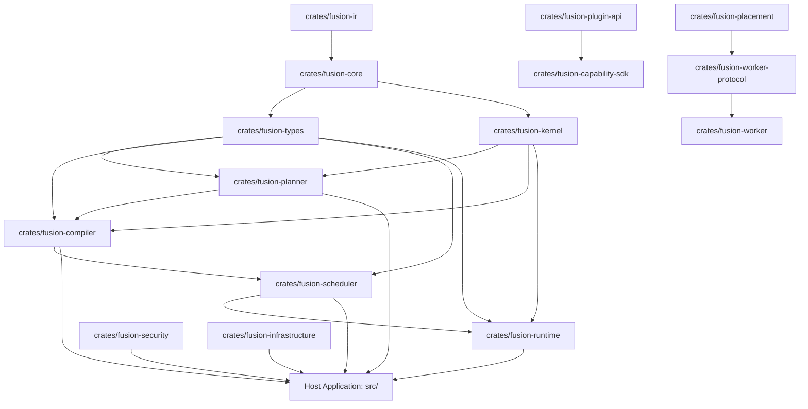
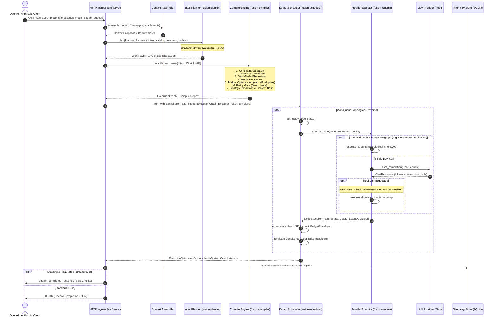

# FusionRouter — System Architecture Review Document

**Platform Version:** `v0.14.5 LTS Foundation` (Roadmap: `v0.15 Distributed Architecture`)  
**Repository:** `NeutronZero/fusion-router`  
**Architectural State:** **CONVERGED** (11/11 Monolith Freeze Gates Enforced)  
**Date:** August 2026  

---

## Executive Summary

**FusionRouter** is a high-performance, compiler-driven, self-hosted LLM orchestration engine written in Rust. Unlike conventional LLM proxy routers that perform superficial point-to-point model routing, FusionRouter treats multi-model workflows as an executable computation graph.

Requests entering the system are parsed for intent and requirements, compiled deterministically into an Intermediate Representation (**WorkflowIR**), passed through a pure multi-pass optimization and validation compiler pipeline, scheduled on an asynchronous Directed Acyclic Graph (**DAG**) scheduler, and executed against pluggable model providers, local tools, and subgraphs with strict resource budgeting and fail-closed security guarantees.

```
┌─────────────────────────────────────────────────────────────────────────────┐
│                            HTTP / API INGRESS                               │
│                OpenAI & Anthropic Compatible Chat Endpoints                 │
└──────────────────────────────────────┬──────────────────────────────────────┘
                                       │ Context + Requirements
                                       ▼
┌─────────────────────────────────────────────────────────────────────────────┐
│                        FUSION-PLANNER (Snapshot-Driven)                     │
│               Synthesizes intent & requirements into WorkflowIR             │
└──────────────────────────────────────┬──────────────────────────────────────┘
                                       │ Immutable WorkflowIR
                                       ▼
┌─────────────────────────────────────────────────────────────────────────────┐
│                        FUSION-COMPILER (Pure Passes)                        │
│   Constraint Validation ➔ Control Flow Validation ➔ Dead-Node Elimination   │
│   ➔ Model Resolution ➔ Budget Optimisation ➔ Policy Pass ➔ Lowering         │
└──────────────────────────────────────┬──────────────────────────────────────┘
                                       │ Immutable ExecutionGraph
                                       ▼
┌─────────────────────────────────────────────────────────────────────────────┐
│                         FUSION-SCHEDULER (DAG Engine)                       │
│             Topological WorkQueue, Concurrency Control, Branching           │
└──────────────────────────────────────┬──────────────────────────────────────┘
                                       │ Dispatched Ready Nodes
                                       ▼
┌─────────────────────────────────────────────────────────────────────────────┐
│                          FUSION-RUNTIME (Execution)                         │
│       Provider Dispatch ➔ Retries & Fallbacks ➔ Fail-Closed Tools           │
│       ➔ Subgraph Expansion (Consensus / Reflection / Debate / ReAct)        │
└──────────────────────────────────────┬──────────────────────────────────────┘
                                       │ Completed ExecutionOutcome
                                       ▼
┌─────────────────────────────────────────────────────────────────────────────┐
│                         RESPONSE ADAPTER / SSE EMITTER                      │
│                  OpenAI JSON Completion / Chunked SSE Stream                │
└─────────────────────────────────────────────────────────────────────────────┘
```

---

## 1. Architectural Invariants & Guiding Laws

The FusionRouter architecture is governed by 17 immutable invariants and 11 automated release gates:

| Invariant | Title | Specification |
|:---|:---|:---|
| **#1** | **Immutable WorkflowIR** | `WorkflowIR` is immutable after construction. Optimizations generate new IR instances or lower directly into `ExecutionGraph`. |
| **#2** | **Immutable ExecutionGraph** | `ExecutionGraph` DAG topology cannot be mutated post-compilation. Dynamic state is strictly tracked inside `ExecutionContext` and `WorkQueue`. |
| **#3** | **Deterministic Compilation** | Given identical `WorkflowIR` and compiler configuration, compilation is 100% deterministic, producing byte-identical canonical JSON output (Zero entropy sources: no `Uuid::new_v4()`, no `rand`, no wall clocks in planning/compilation). |
| **#4** | **Isolated Planner** | The planner never initiates external network calls or provider requests. Planning is snapshot-driven over capabilities, model catalogs, telemetry, and policy declarations. |
| **#5** | **Worker Boundary** | Workers execute explicit execution tasks assigned by the coordinator and never participate in DAG planning or graph compilation. |
| **#6** | **Pure Repositories** | Storage repositories in `fusion-infrastructure` manage persistence and transaction isolation exclusively without embedded business logic. |
| **#7** | **Kernel Independence** | `fusion-kernel` maintains zero dependencies on infrastructure, network, database, or UI crates. |
| **#8** | **Versioned Contracts** | All externally consumed contracts (`REST API`, `Worker Protocol`, `Plugin SDK`, `WorkflowIR`, `Execution ABI`) carry explicit version semantics (`v1`). |
| **#9** | **Strongly-Typed IDs** | Every execution is tagged with a strongly-typed `ExecutionId` correlating traces, spans, SQLite evidence records, and metric events. |
| **#10** | **Certified Performance SLOs** | Regression-tested budgets: Planner `<10ms`, Compiler `<20ms`, Scheduler `<5ms`, Runtime Overhead `<10ms`, Replay `<20ms`. |
| **#11** | **Single Source of Truth** | All domain and business logic resides in `crates/fusion-*`. Host modules in `src/` serve as thin adapters, wiring, and ingress servers. |
| **#12** | **Single-Worker Lease Exclusivity** | Every graph node is leased by at most one worker under a time-bounded epoch lease. |
| **#13** | **Immutable PlacementGraph** | Placement and execution plans are immutable. Failovers or retries produce new versioned instances. |
| **#14** | **Deterministic Placement** | Cluster placement decisions are pure functions over `(PlacementPolicy, ClusterState, ExecutionGraph)`. |
| **#15** | **Semantic Adapter Annotation** | Execution lowering preserves planning node intent in an explicit `semantic_kind` metadata annotation. |
| **#16** | **NanoUSD Monetary Accounting** | All internal financial calculations, token conversions, and budget limits use integer `NanoUSD` (`$0.000000001 = 1 NanoUSD`). Floating-point `f64` is banned from internal cost accounting. |
| **#17** | **Control-Plane Authority** | The application maintains a single `PolicyRegistry` and a frozen `CapabilityRegistry` instantiated at startup in `AppState`. |

---

## 2. Workspace Crate Topology & Layer Hierarchy

The workspace is organized into clean, single-responsibility crates enforcing acyclic dependency layering:



### Crate Breakdown

1. **`crates/fusion-ir`**: Canonical provider-independent Intermediate Representation. Provides `WorkflowBuilder`, `WorkflowIR`, `WorkflowNode`, `WorkflowEdge`, and structural validators. It is a leaf crate with zero internal dependencies.
2. **`crates/fusion-core`**: Foundation types, domain errors (`PlatformError`), lifecycle states, and the integer monetary type [`NanoUSD`](file:///c:/Projects/fusion-router/crates/fusion-core/src/monetary.rs).
3. **`crates/fusion-types`**: Shared execution-plane structures (`WorkflowIR`, `ExecutionGraph`, `ExecutionNode`, `ExecutionEdge`, `BudgetEnvelope`, `NodeState`, `ExecutionResult`).
4. **`crates/fusion-kernel`**: Core capabilities (`CapabilityCatalog`, `CapabilitySystem`), event bus (`EventBus`, `KernelEvent`), and the abstract `ResourceManager` trait.
5. **`crates/fusion-planner`**: Intent planner (`IntentPlanner`, `PlannerService`). Translates natural language requests and `PlanningRequest` snapshots into deterministic `WorkflowIR`.
6. **`crates/fusion-compiler`**: Pure compilation engine (`CompilerEngine`) containing 5 pure passes, dead-node elimination, route scoring (`ExplainRouteScore`), custom strategy lowering, and canonical content hashing (`compute_workflow_content_hash`).
7. **`crates/fusion-scheduler`**: Graph execution orchestrator (`DefaultScheduler`, `WorkQueue`). Evaluates DAG topological dependencies, ready queues, conditional edges, loop iterations, and cancellation tokens.
8. **`crates/fusion-runtime`**: Node execution engine (`RuntimeEngine`, `ProviderExecutor`). Manages provider communications (`ChatProvider`), fail-closed tool loops (`ToolRegistry`), retry policies, and subgraph execution.
9. **`crates/fusion-placement`**: Distributed scheduling contracts (`PlacementEngine`, `PlacementGraph`, `ExecutionPlan`).
10. **`crates/fusion-worker-protocol` & `crates/fusion-worker`**: RPC and messaging contracts for remote worker nodes, epoch heartbeats, and lease handling.
11. **`crates/fusion-security`**: Cryptographic secret storage (`SecretManager`) backed by `AES-256-GCM` with secure random nonces and secret redaction.
12. **`crates/fusion-infrastructure`**: Storage repositories (SQLite telemetry, session storage, archive packagers) with zero business logic.
13. **`crates/fusion-plugin-api` & `crates/fusion-capability-sdk`**: C-ABI dynamic plugin loading interfaces (`libloading`) and macro derivations for third-party providers.
14. **`src/`**: Host executable. Wires `AppState`, HTTP routes (`/v1/chat/completions`, `/v1/messages`, `/health`, `/v1/admin`), provider connectors (OpenRouter, Zen, Ollama, Gemini), and SSE streaming.

---

## 3. End-to-End Request Lifecycle & Execution Pipeline



---

## 4. Compiler Pipeline & Optimization Architecture

The compiler pipeline (`fusion-compiler`) guarantees **Zero Entropy** and **Purity**: no I/O, no network calls, and zero external side effects.

```
                  ┌───────────────────────────────┐
                  │          WorkflowIR           │
                  └───────────────┬───────────────┘
                                  │
                                  ▼
             ┌─────────────────────────────────────────┐
             │ 1. ConstraintValidationPass             │
             │    - IR node count >= 1                 │
             └────────────────────┬────────────────────┘
                                  │
                                  ▼
             ┌─────────────────────────────────────────┐
             │ 2. ControlFlowValidationPass            │
             │    - Edge boundary integrity            │
             │    - Conditional / Loop / Join shape    │
             │    - 3-Color DFS Cycle Detection        │
             └────────────────────┬────────────────────┘
                                  │
                                  ▼
             ┌─────────────────────────────────────────┐
             │ 3. StrategyLoweringPass                 │
             │    - Lowers strategy kinds into         │
             │      canonical subgraph structures      │
             └────────────────────┬────────────────────┘
                                  │
                                  ▼
             ┌─────────────────────────────────────────┐
             │ 4. DeadNodeEliminationPass              │
             │    - BFS reachability from root nodes   │
             │    - Prunes orphaned nodes and edges    │
             └────────────────────┬────────────────────┘
                                  │
                                  ▼
             ┌─────────────────────────────────────────┐
             │ 5. ModelResolutionPass                  │
             │    - Maps required capabilities to      │
             │      concrete catalog models            │
             └────────────────────┬────────────────────┘
                                  │
                                  ▼
             ┌─────────────────────────────────────────┐
             │ 6. BudgetOptimisationPass               │
             │    - Queries ResourceManager::can_afford│
             │    - Fails compilation on quota breach  │
             └────────────────────┬────────────────────┘
                                  │
                                  ▼
             ┌─────────────────────────────────────────┐
             │ 7. Policy Pass (Optional PolicyIR)      │
             │    - Deny rules trigger compilation err │
             └────────────────────┬────────────────────┘
                                  │
                                  ▼
             ┌─────────────────────────────────────────┐
             │ 8. lower_to_graph_with_compilers        │
             │    - Lowers to ExecutionGraph           │
             │    - Attaches pre-built subgraphs       │
             │    - Computes canonical content hash    │
             └────────────────────┬────────────────────┘
                                  │
                                  ▼
                  ┌───────────────────────────────┐
                  │        ExecutionGraph         │
                  └───────────────────────────────┘
```

### Strategy Lowering & Subgraph Expansion

Strategies transform a single logical node into an internal execution sub-topology:

- **Single**: Direct 1:1 model execution (`[LLM]`).
- **Consensus**: Parallel generation across N models (`[LLM_1, LLM_2, ..., LLM_N]`), converging into a `[Judge]` node.
- **Reflection**: Multi-step critique loop (`[Generate] ➔ [Review] ➔ [Refine / Gate]`).
- **Chain**: Sequential multi-stage refinement (`[Stage_1] ➔ [Stage_2] ➔ ... ➔ [Stage_N]`).
- **Debate**: Competing debater nodes presenting viewpoints to an impartial `[Judge]`.
- **ReAct**: Autonomous loop interleaving `[Reason] ➔ [Tool Action] ➔ [Observation]`.
- **Custom**: Dynamic user-defined strategies lowered via registered `StrategyCompiler` delegates.

---

## 5. DAG Scheduler & Runtime Engine

### WorkQueue & Dependency Management
The `WorkQueue` tracks node lifecycles (`Pending`, `Running`, `Succeeded`, `Failed`, `Skipped`):
1. **Topological Readiness**: A node is marked ready when all incoming dependency edges have succeeded.
2. **Conditional Routing**: When a `Conditional` node completes, the output string activates only matching conditioned edges (e.g. `"allow"` vs `"deny"`). Unselected branches remain `Pending` / `Skipped`.
3. **Loop Management**: Loop nodes support bounded iterations (`max_iterations`). When continuing, the loop body node states are reset to `Pending` and re-queued.
4. **Cooperative Cancellation**: Every node batch execution is raced against a `tokio_util::sync::CancellationToken`. Cancelled runs yield immediate aborts without dangling worker tasks.

### Fail-Closed Security & Tool Boundary (ADR-037)
Tools executed by the runtime must adhere to strict trust boundaries:
- **Default Deny**: Auto-execution of tool calls is disabled by default (`allow_auto_exec = false`).
- **Explicit Allowlist**: Tool calls emitted by models are only executed if explicitly present in the node's `tool_allowlist` configuration array and registered in the `ToolRegistry`.
- **Sandboxed Execution**: Unlisted or missing tools return a structured error response to the agentic loop, preventing unauthorized code execution or system escalation.

### Streaming Model & Deliberative DAG Execution (Gate 08)
Because FusionRouter compiles multi-model workflows into deliberative execution graphs (e.g. 3-member consensus judged by an arbiter, or iterative reflection loops), streaming intermediate raw tokens prior to exit-node validation would break deliberative integrity.
- **Architectural Parity (Gate 08)**: All requests (`stream: true` and `stream: false`) execute through the identical compiled `ExecutionGraph`, DAG scheduler, and fail-closed budget checks.
- **SSE Transport Adapter**: In v0.14.5, `stream: true` completes authoritative DAG execution and then serializes the validated exit node output into OpenAI/Anthropic-compatible SSE chunks (`stream_completed_response`).
- **Real-Time Metering & Budget Cutoff**: `MeteredStream` (`src/resource/cancelling_stream.rs`) tracks chunks in integer `NanoUSD` and enforces fail-closed mid-stream cancellation when budget envelope ceilings are breached.
- **Roadmap v0.15**: Direct token-level stream multiplexing for single-node bypasses and streaming intermediate deliberation feeds is slated for the v0.15 distributed runtime sprint.

---

## 6. Resource Management & Financial Accounting

### NanoUSD Precision Accounting
Floating-point calculations cause rounding drifts and non-deterministic financial states. FusionRouter enforces integer arithmetic across all crates:
$$\text{1 USD} = 10^9 \text{ NanoUSD}$$
$$\text{1 Millicost} = 10^6 \text{ NanoUSD}$$

Example Token Rates:
- Input Tokens: `2,000,000 NanoUSD / 1,000 tokens` ($0.002 / 1k)
- Output Tokens: `10,000,000 NanoUSD / 1,000 tokens` ($0.010 / 1k)

### Per-Request Budget Envelopes
The [`BudgetEnvelope`](file:///c:/Projects/fusion-router/crates/fusion-types/src/lib.rs#L379) uses thread-safe atomic counters (`AtomicU64`) shared across parallel execution branches. Spend is validated:
1. **Prior to Execution**: Compiler checks `ResourceManager::can_afford`.
2. **At Loop Heads**: Bound checks on iteration counts prevent runaway recursive loops.
3. **Post Node Usage**: Immediate atomic accumulation of prompt and completion token costs. If the budget is breached, outstanding nodes are marked `Skipped`, and the execution halts gracefully.

---

## 7. Architectural Governance & Monolith Freeze Firewall

The repository's architectural purity is enforced by `scripts/check_monolith_freeze.py`, which validates 11 release-blocking gates on every build:

```
======================================================================
FusionRouter Architectural Convergence Firewall Verification
======================================================================
Gate 01 Planner Authority     ............. PASS (Canonical snapshot-driven planner in fusion-planner)
Gate 02 Compiler Authority    ............. PASS (No host compiler passes in src/compiler)
Gate 03 Strategy Authority    ............. PASS (Host executor contains only runtime delegation adapters)
Gate 04 Runtime Authority     ............. PASS (Runtime authority consolidated in crates/fusion-runtime)
Gate 05 Attestation Authority ............. PASS (ArchivePackageVerifier used in main.rs)
Gate 06 Policy Authority      ............. PASS (PolicyRegistry is single authoritative policy source)
Gate 07 Capability Authority  ............. PASS (PluginManager authority with executed startup lifecycle)
Gate 08 Streaming Authority   ............. PASS (Streaming and non-streaming share standard graph)
Gate 09 Monetary Authority    ............. PASS (NanoUSD is canonical integer monetary type across all crates)
Gate 10 Fallback Elimination  ............. PASS (Zero strategy passthroughs & fail-closed strategy validation)
Gate 11 Deterministic Compile ............. PASS (Deterministic planning & byte-identical canonical compilation)
======================================================================
ARCHITECTURE STATUS: CONVERGED
======================================================================
```

---

## 8. Roadmap & Distributed Runtime (v0.15+)

FusionRouter is expanding from a single-node engine to a multi-node distributed execution fabric without altering the core compiler invariants:

```
┌─────────────────────────────────────────────────────────────────────────────┐
│                 COORDINATOR NODE (Compiler & Placement Engine)              │
│      WorkflowIR ➔ ExecutionGraph ➔ PlacementEngine ➔ ExecutionLeases        │
└───────────────────────┬─────────────────────────────┬───────────────────────┘
                        │ Lease Dispatch              │ Lease Dispatch
                        ▼                             ▼
┌──────────────────────────────────┐       ┌──────────────────────────────────┐
│      REMOTE WORKER NODE A        │       │      REMOTE WORKER NODE B        │
│  - Executes Assigned Sub-DAGs    │       │  - Executes Assigned Sub-DAGs    │
│  - Locality Zone 1 (GPU Cluster) │       │  - Locality Zone 2 (Tool Worker) │
│  - Monotonic Epoch Heartbeats    │       │  - Monotonic Epoch Heartbeats    │
└──────────────────────────────────┘       └──────────────────────────────────┘
```

1. **Placement Engine (`fusion-placement`)**: Evaluates multi-dimensional placement vectors:
   $$\text{Score} = (0.30 \cdot \text{Cap}) + (0.25 \cdot \text{Locality}) + (0.20 \cdot \text{Load}) + (0.15 \cdot \text{Latency}) + (0.10 \cdot \text{Cost})$$
2. **Worker Protocol (`fusion-worker-protocol`)**: gRPC / WebSocket protocol managing task leases, epoch renewal, and crash failover.
3. **Deterministic Replay Attestation**: Full execution sessions serialized to `.fusion` bundles, enabling zero-side-effect offline replay simulation.

---

## Conclusion & Assessment

FusionRouter demonstrates a mature, robust systems architecture designed for reliability, determinism, and high throughput. By cleanly separating planning, pure compilation, topological scheduling, and execution, the system achieves:
- **Predictable Latency & Cost**: Controlled through deterministic compilation and atomic budget envelopes.
- **Resilient Multi-Model Orchestration**: Complex workflows (Debate, Reflection, Consensus) execute seamlessly over standard DAGs.
- **Fail-Closed Security**: Strict tool allowlisting, policy gating, and encrypted secret management.
- **Zero Architectural Drift**: Monolith freeze firewall guarantees strict separation between crates and host adapters.
